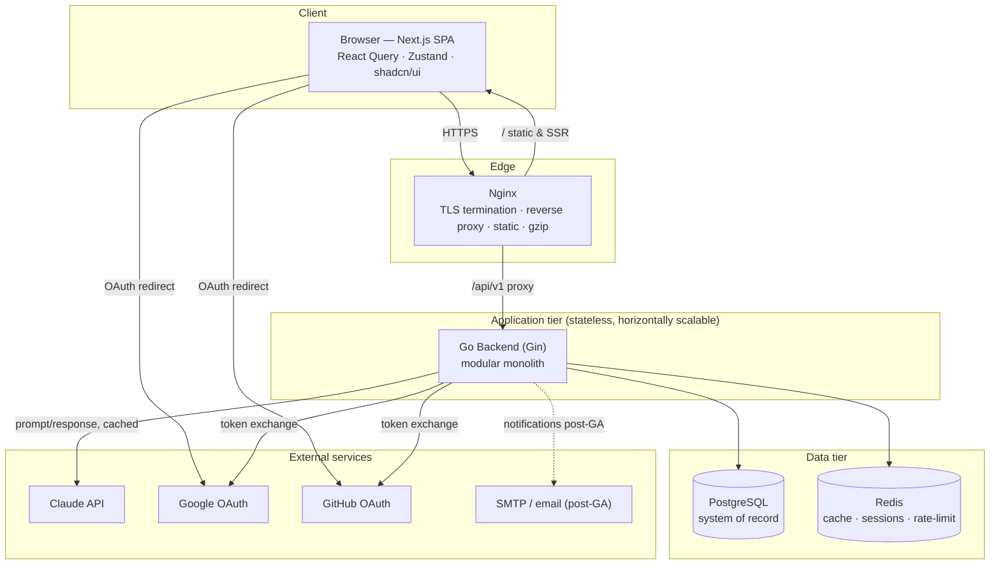
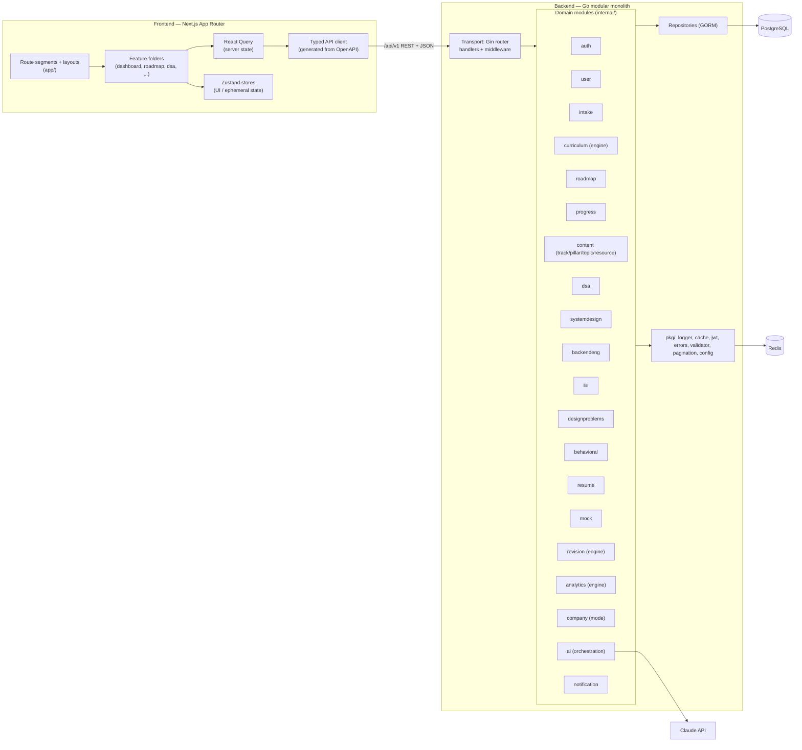
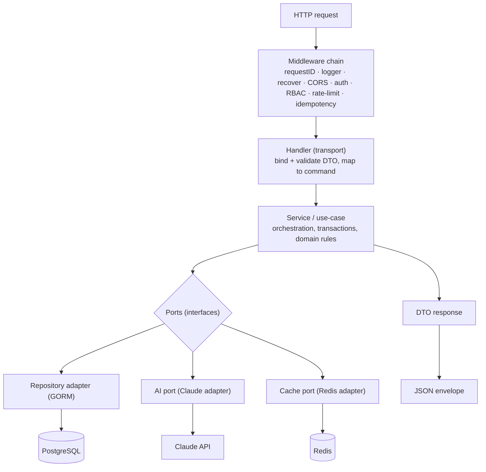
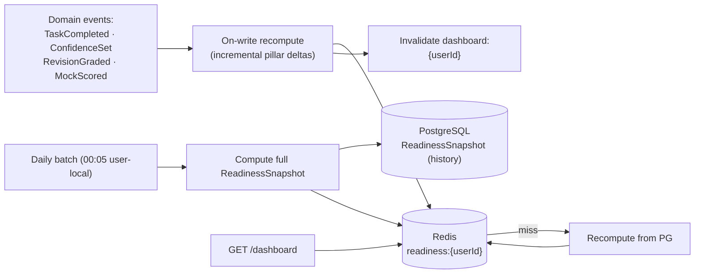
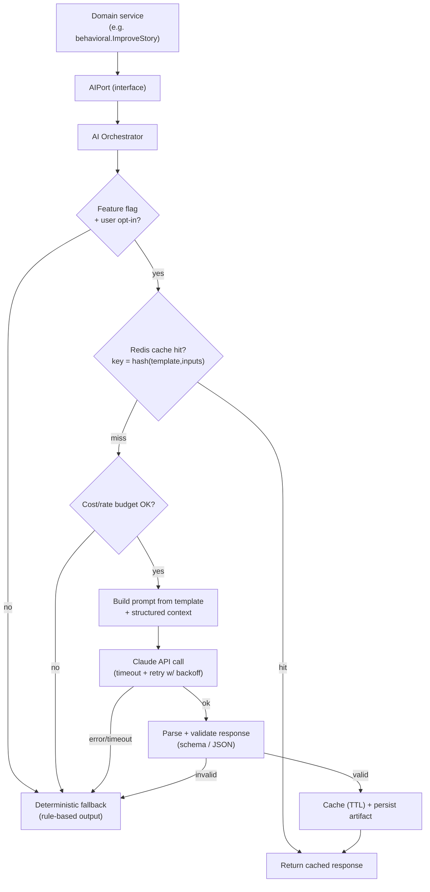
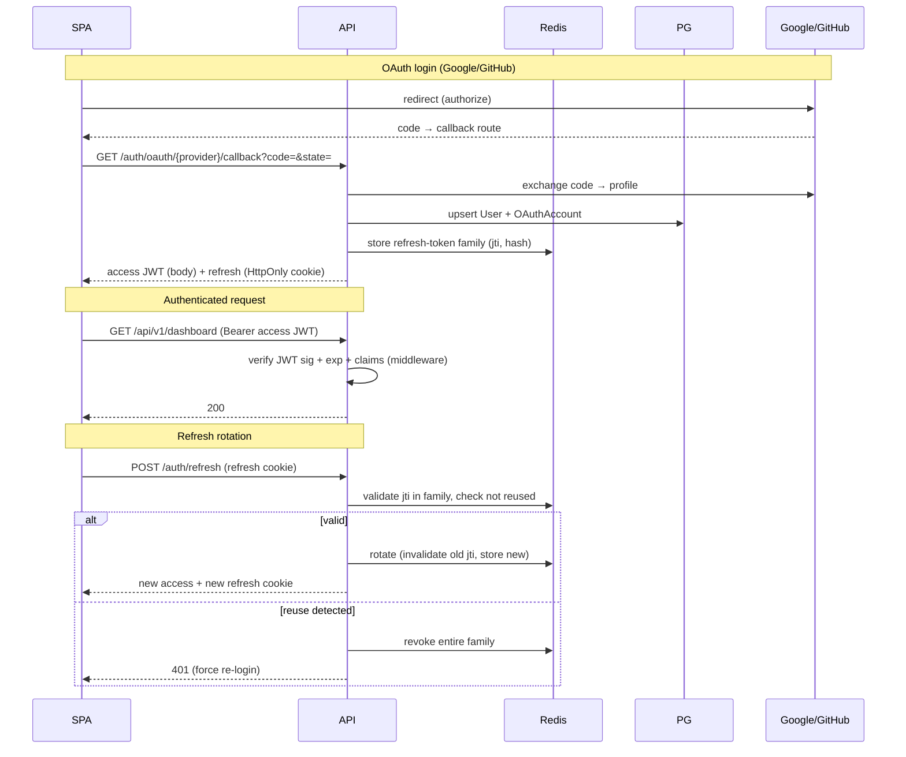
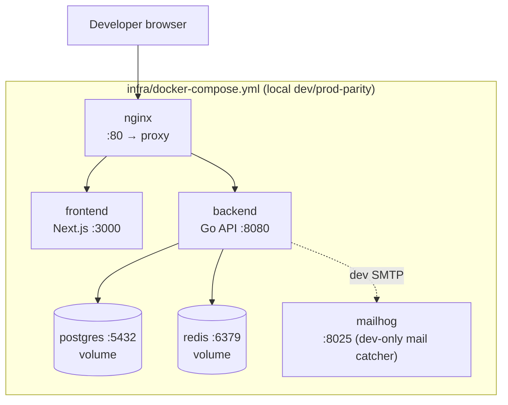

# InterviewOS — System Architecture

**Status:** Draft v1.0
**Owner:** Founding Engineering / Senior Staff
**Last updated:** 2026-06-29
**Track at GA:** Backend SDE3
**Companion docs:** `01-PRD.md` (product), `02-SRS.md` (functional spec), `04-DATABASE-SCHEMA.md` (tables/indexes), `openapi.yaml` (API), `07-ROADMAP.md` (sequencing)

---

## 1. Architecture overview & principles

InterviewOS is a **modular monolith**: a single deployable Go backend partitioned into strongly-bounded domain modules (one per pillar plus the cross-cutting engines), fronted by a Next.js SPA, with PostgreSQL as the system of record and Redis for cache/sessions/rate-limiting. A monolith is the right call at GA — one deployable, one transaction boundary, no premature network seams — while module boundaries are drawn cleanly enough that any module could be extracted into a service later without rewriting business logic.

### 1.1 Guiding principles

- **Clean / Hexagonal architecture.** Each domain module exposes a *service* (use-case) layer that depends only on *ports* (Go interfaces). Adapters — HTTP transport, GORM repositories, the Claude client, the mailer — implement those ports and are injected at composition time (`cmd/api/main.go`). Business rules never import Gin, GORM, or `net/http`.
- **Dependency inversion.** Dependencies point inward: `transport → service → domain ← repository`. The domain defines `Repository` and `xxxPort` interfaces; outer layers implement them. The domain layer imports nothing from the framework.
- **SOLID.** Single-responsibility modules; small, role-based interfaces (interface segregation); open for extension via new tracks/pillars without modifying engines (the curriculum engine reads track-scoped data, it is not hardcoded to Backend SDE3).
- **Separation of concerns.** Transport handles HTTP (bind/validate/serialize); services orchestrate use-cases and own transactions; repositories own persistence; the domain owns invariants. Cross-cutting concerns (auth, logging, tracing, rate-limit) live in middleware and `pkg/`.
- **Determinism first, AI second.** Per PRD §9, the curriculum/revision/analytics engines are deterministic and are the source of truth. AI is an *optional augmentation* behind a port with a deterministic fallback — it can be disabled without breaking any P0 flow.
- **12-Factor.** Config from environment; stateless processes; backing services (Postgres/Redis/Claude) attached via URLs; logs to stdout as JSON; build/release/run separation via Docker; graceful shutdown on SIGTERM; dev/prod parity via docker-compose mirroring the deployed topology.
- **Stateless API + Redis.** API instances hold no per-request session state in memory. Sessions, refresh-token rotation state, rate-limit counters, and dashboard aggregates live in Redis, enabling horizontal scale-out behind a load balancer.

### 1.2 Technology stack

| Layer | Choice |
|-------|--------|
| Frontend | Next.js (App Router), React, TypeScript, React Query, Zustand, shadcn/ui, Tailwind, React Hook Form + zod |
| API | Go, Gin, GORM, golang-migrate, validator/v10 |
| Datastore | PostgreSQL (system of record), Redis (cache/session/rate-limit) |
| AI | Claude API (via an internal `ai` orchestration module behind a port) |
| Edge | Nginx reverse proxy / TLS termination |
| Infra | Docker multi-stage, docker-compose (local), GitHub Actions (CI/CD), optional Kubernetes + Helm |

---

## 2. High-level system context



---

## 3. Container / component diagram



---

## 4. Backend architecture

### 4.1 Layering

The backend is strictly layered. A request flows **transport → service → repository → DB** and never skips inward or reaches outward.



**Layer responsibilities**

- **Transport (Gin handlers + middleware).** Parse path/query/body into request DTOs, validate with `validator/v10` + zod-mirrored rules, invoke a service method, map domain results/errors to the JSON response envelope. No business logic, no DB access.
- **Service / domain.** The use-case layer: orchestrates repositories and ports, owns the transaction boundary (`db.Transaction(func(tx) {...})`), enforces invariants, emits domain events (e.g., `TopicCompleted` → revision scheduling). Pure Go; depends only on interfaces defined in its own module.
- **Repository (GORM).** Implements the module's `Repository` interface. Owns SQL/GORM, eager-loading, pagination, soft-delete scopes, and index-aware queries. Returns domain entities, not GORM-coupled rows leaking upward.
- **DB.** PostgreSQL via a pooled `*gorm.DB`. Schema evolves only through versioned migrations.

### 4.2 Module boundaries → pillars + engines

Each `internal/<module>` package owns: `entity.go` (domain types), `service.go` (use-cases + ports it depends on), `repository.go` (interface), `repository_gorm.go` (adapter), `handler.go` (transport), `dto.go`, `routes.go`, and `*_test.go`.

| Module | Maps to | Owns |
|--------|---------|------|
| `auth` | Auth (PRD 7.1) | login/register, OAuth exchange, JWT issuance, refresh rotation, password reset |
| `user` | Accounts | `User`, profile, preferences |
| `intake` | Intake/onboarding | `UserProfile` capture, self-assessment, hour budget, target role/company |
| `content` | Resource Library + content spine | `Track → Pillar → Topic → Subtopic`, `Resource`, `TopicResource` (dedup) |
| `dsa` | DSA pillar | `Problem` (canonical), `Pattern`, `ProblemSource`, `ProblemCompanyFrequency` |
| `systemdesign` | System Design pillar | `DesignProblem` HLD sections, SD topics |
| `backendeng` | Backend Engineering pillar | depth topics (Kafka/Redis/consensus/Go runtime…) |
| `lld` | LLD pillar | `LLDProblem`, SOLID/patterns content |
| `designproblems` | Design Problems catalog | ordered HLD problem catalog + structured sections |
| `behavioral` | Behavioral pillar | `BehavioralStory` (STAR fields) |
| `resume` | Resume pillar | `ResumeProfile`, `ResumeProject`, ATS scoring |
| `curriculum` | **Curriculum Engine** | content selection/ordering, roadmap generation algorithm, Today assembly logic |
| `roadmap` | Roadmap/plan persistence | `Roadmap/RoadmapWeek/PlanDay/PlanTask`, reschedule, plan-day reads |
| `progress` | Progress tracking | `UserTopicProgress`, task completion, confidence, study sessions |
| `revision` | **Revision Engine** | `RevisionItem`, spaced-repetition scheduling, due generation, recall handling |
| `analytics` | **Analytics Engine** | `ReadinessSnapshot`, streaks, weak/strong topics, readiness-date prediction |
| `company` | **Company Mode** | `Company`, `CompanyWeight`, roadmap re-weighting |
| `mock` | Mock module | `MockInterview`, `MockFinding`, weakness → remediation tasks |
| `ai` | **AI orchestration** | Claude client, prompt templates, response parsing, cache, fallback |
| `notification` | Notifications | `Notification`, in-app delivery, due/streak reminders |

### 4.3 Go package / folder layout

```
backend/
├── cmd/
│   ├── api/main.go            # composition root: wire config→db→redis→repos→services→router; graceful shutdown
│   ├── migrate/main.go        # golang-migrate runner (up/down/force)
│   └── seed/main.go           # idempotent curriculum/content seeder (tracks, pillars, problems, companies)
├── internal/
│   ├── auth/                  # transport+service+repo per module (see 4.2)
│   ├── user/
│   ├── intake/                # onboarding/profile capture
│   ├── curriculum/            # curriculum engine
│   ├── roadmap/               # roadmap/plan persistence + reschedule
│   ├── progress/              # progress tracking + task completion
│   ├── content/
│   ├── dsa/
│   ├── systemdesign/
│   ├── backendeng/
│   ├── lld/
│   ├── designproblems/
│   ├── behavioral/
│   ├── resume/
│   ├── mock/
│   ├── revision/              # revision engine
│   ├── analytics/             # analytics/readiness engine
│   ├── company/               # company mode
│   ├── ai/                    # Claude orchestration (port + adapter + prompts + fallback)
│   ├── notification/
│   └── platform/
│       ├── server/            # Gin engine assembly, route registration, middleware wiring
│       ├── middleware/        # requestid, logger, recover, cors, auth, rbac, ratelimit, idempotency
│       └── database/          # gorm.DB factory, pool config, transaction helpers
├── pkg/                       # reusable, domain-agnostic libraries
│   ├── config/                # 12-factor env loader + validation
│   ├── logger/                # structured (slog/zap) JSON logger
│   ├── jwt/                   # access/refresh token mint + verify
│   ├── cache/                 # Redis client + typed get/set/del + locks
│   ├── apierror/              # error taxonomy + envelope mapping
│   ├── pagination/            # offset paging helpers (page/page_size/sort/filter/q)
│   ├── validate/             # validator/v10 setup + custom rules
│   └── otel/                  # tracing/metrics setup
├── migrations/                # NNNN_*.up.sql / .down.sql (golang-migrate)
├── api/openapi.yaml           # OpenAPI source of truth (contract-first, swag annotations)
├── seed/<module>/*.yaml       # seed data per module
├── Dockerfile                 # multi-stage (backend/Dockerfile)
├── go.mod
└── go.sum
```

### 4.4 Dependency rules

1. **`internal/<module>` may not import another module's internals** — only its exported *service interface* (port). Cross-module calls go through ports, wired in `cmd/api`. Example: `revision` consumes a `CompletionEvent` published by `curriculum`; `analytics` reads `revision` and `curriculum` *ports*, never their repositories.
2. **`pkg/` never imports `internal/`.** It is leaf, domain-agnostic, independently testable.
3. **The domain/service layer never imports Gin or GORM.** GORM lives only in `*_repository_gorm.go`; Gin only in `handler.go`/`platform`.
4. **Composition only in `cmd/`.** Concrete adapters are constructed and injected exactly once, at startup. This keeps modules unit-testable with fakes.
5. **No import cycles.** Enforced in CI with `go vet` + an import-linter rule. Shared cross-module types (events, IDs) live in a small `internal/platform/event` package that everything may depend on but which depends on nothing.

---

## 5. Frontend architecture

### 5.1 App Router structure

```
frontend/
├── app/
│   ├── (marketing)/                 # public landing, login, signup
│   │   ├── login/page.tsx
│   │   └── signup/page.tsx
│   ├── (app)/                       # authenticated shell (route group)
│   │   ├── layout.tsx               # app shell: nav, sidebar, auth guard
│   │   ├── dashboard/page.tsx       # "Today" + readiness
│   │   ├── roadmap/[week]/page.tsx
│   │   ├── dsa/...                  # pillar feature routes
│   │   ├── system-design/...
│   │   ├── backend-engineering/...
│   │   ├── lld/...
│   │   ├── design-problems/...
│   │   ├── behavioral/...
│   │   ├── resume/...
│   │   ├── mock/...
│   │   ├── revision/page.tsx
│   │   └── analytics/page.tsx
│   ├── api/auth/callback/route.ts   # OAuth callback handler
│   ├── layout.tsx                   # root: providers (RQ, theme), fonts
│   └── globals.css
├── features/                        # feature-folder organization
│   ├── dashboard/{components,hooks,api,types}
│   ├── roadmap/...
│   ├── dsa/...
│   └── ...                          # one folder per pillar/engine
├── components/ui/                   # shadcn/ui primitives (button, dialog, ...)
├── lib/
│   ├── api/client.ts                # generated typed client (openapi-typescript + fetch)
│   ├── api/queries.ts               # React Query hooks factory
│   ├── auth/                        # token store, refresh interceptor
│   └── utils.ts
├── stores/                          # Zustand stores (UI state)
├── hooks/                           # shared hooks
└── package.json
```

**Conventions**

- **Feature-folder organization.** Each feature (`features/<name>`) co-locates its components, React Query hooks, API calls, and types. Route segments in `app/` stay thin — they compose feature components and set layouts/metadata.
- **Server vs. client components.** Static shells and metadata render as server components; interactive, data-bound views are client components using React Query. Auth-gated pages are guarded in the `(app)/layout.tsx` boundary.

### 5.2 Data layer

- **Server state → React Query.** All backend data (Today plan, roadmap, readiness, problems) is fetched/cached/invalidated via React Query. Query keys are namespaced (`['today', date]`, `['roadmap', weekId]`, `['readiness']`). Mutations (complete task, log confidence) call the API then `invalidateQueries` the affected keys so the dashboard updates without a full reload (PRD 7.3 acceptance).
- **Typed API client from OpenAPI.** The backend maintains the spec source of truth at `backend/api/openapi.yaml` (snapshot published to `docs/openapi.yaml`); `openapi-typescript` generates request/response types and a thin typed `fetch` client into `lib/api/client.ts`. This guarantees the frontend contract matches the backend and breaks the build on drift.
- **UI / ephemeral state → Zustand.** Sidebar collapse, theme, modal open-state, in-progress timers, optimistic toggles. Zustand never holds server-authoritative data — that is React Query's job (single source of truth).

### 5.3 Forms, components, auth

- **Forms.** React Hook Form for state/perf + zod schemas for validation. zod schemas are shared with the inferred types from the generated client where shapes align, giving end-to-end type safety on intake, story builder, resume forms.
- **Component library.** shadcn/ui (Radix + Tailwind) for accessible primitives; design tokens drive dark mode (PRD 7.8). Keyboard-driven navigation via Radix focus management + a command palette.
- **Auth handling.** Access token (short-lived JWT) held in memory; refresh token in an **HttpOnly, Secure, SameSite=Strict cookie** so JS cannot read it (mitigates XSS token theft). A fetch interceptor catches `401`, calls `/api/v1/auth/refresh` (cookie sent automatically), retries the original request once, and on refresh failure redirects to login. OAuth uses the redirect flow: backend sets the refresh cookie and returns the access token to the SPA callback route.

---

## 6. Curriculum Engine design

The Curriculum Engine turns intake + company weights + hour budget into a deterministic, dated N-week roadmap, then assembles the daily "Today" view and adapts when the user falls behind.

### 6.1 Roadmap generation (deterministic)

**Inputs:** `UserProfile` (years of experience, target role/level, self-assessed pillar strengths 1–5, hours/week `H`, start date `S`, weeks `N=12`), the active `Track` content graph (pillars → topics with `est_hours`, `priority`, `difficulty`, prerequisites), and `CompanyWeight[]` for the target company.

**Algorithm:**

```text
function generateRoadmap(profile, track, companyWeights, N=12):
    H        = profile.hoursPerWeek
    budget   = H * N                       # total available study hours
    pillars  = track.pillars               # DSA, SD, LLD, BEng, Behavioral, Resume

    # 1. Base pillar allocation from track defaults, then skew by company + self-assessment
    for p in pillars:
        base   = track.defaultWeight[p]                       # sums to 1.0
        cmult  = companyWeights[p] or 1.0                     # e.g. Amazon: Behavioral 1.5, DSA 1.3
        gap    = (6 - profile.selfAssessed[p]) / 5            # weaker self-rating => more time
        score[p] = base * cmult * (0.6 + 0.4*gap)
    normalize(score)                                          # re-normalize to sum 1.0
    hours[p] = round(score[p] * budget)

    # 2. Select & order content per pillar within its hour budget
    plannedTopics = []
    for p in pillars:
        topics = track.topics(p)
        topics = topologicalSort(topics by prerequisite)      # respect deps
        topics = stableSort(topics by (priority desc,         # company-weighted priority first
                                       companyFrequency desc,
                                       difficulty asc))         # easy->hard within priority
        acc = 0
        for t in topics:
            if acc + t.estHours <= hours[p]:
                plannedTopics.add(t); acc += t.estHours

    # 3. Sequence across the N weeks, interleaving pillars (avoid mono-pillar weeks)
    weeks = [emptyWeek() for _ in range(N)]
    roundRobin(plannedTopics grouped by pillar) into weeks
        respecting per-week capacity H and prerequisite ordering

    # 4. Distribute each week's topics into PlanDays, emit PlanTasks
    for w in weeks:
        days = activeStudyDays(profile)                       # e.g. 6 days/week
        dayBudget = H / len(days)
        for topic in w.topics:
            emit study task  (kind=study,  item=topic,   est=topic.theoryHours)
            for prob in selectProblems(topic, companyFreq): # DSA: dedup canonical set
                emit solve task (kind=solve, item=prob,    est=prob.estMinutes)
            for res in topic.primaryResources:
                emit read/watch task (kind=read|watch, item=res)
            packTasksIntoDays(days, dayBudget)                # bin-pack by est hours

    return persist(Roadmap{weeks, days, tasks}, profile.startDate=S)
```

**Determinism & guarantees:** identical inputs ⇒ identical roadmap (stable sorts, fixed tie-breakers, no randomness). The bin-packer enforces the PRD 7.2 acceptance: total weekly hours never exceed budget by > 10% (it stops adding tasks once a day/week is within tolerance and pushes overflow to later weeks). `PlanTask` uses the polymorphic `(item_type, item_id)` + `kind` shape from PRD §8 so one unified Today list spans heterogeneous content.

### 6.2 "Today" plan assembly

The Today view is *assembled at read time* from already-generated `PlanDay`/`PlanTask` rows plus due revisions and due mocks — it is not re-generated.

```text
function getToday(userId, date):
    planDay   = repo.planDay(userId, date)                 # today's pre-generated tasks
    dueRev    = revisionEngine.dueItems(userId, date)      # spaced-repetition due today
    dueMocks  = mockEngine.scheduled(userId, date)
    overdue   = repo.incompletePlanTasks(userId, < date)   # carried-over, capped

    tasks = merge(planDay.tasks, dueRev→reviseTasks, dueMocks→mockTasks, overdueSlice)
    tasks = sort(tasks by (priority desc, kind order, difficulty))
    return TodayDTO{date, tasks, estimatedHours, streak}
```

Results are cached in Redis (`today:{userId}:{date}`, TTL to end-of-day) and invalidated on any task completion for that user/date.

### 6.3 Adaptivity (fall-behind reschedule)

```text
function reconcile(userId, today):
    overdue = incompleteTasks(userId, dueDate < today)
    if overdue.empty(): return
    capacity = remainingWeeklyCapacity(userId, week_of(today))   # H minus already-planned
    # 1. Pull high-priority overdue forward into today's slack
    move(highPriority(overdue), into=today, upTo=capacity)
    # 2. Spread the remainder across upcoming low-load days within the same week
    spread(remaining(overdue), acrossDaysWithSlack(week_of(today)))
    # 3. If a week overflows beyond budget+10%, shift the lowest-priority tail
    #    topics into the next week (cascading), and recompute the readiness date.
    if weekOverBudget(week): cascadeShiftTail(week → next)
    analytics.recomputeReadinessDate(userId)
```

Reschedule runs on demand (Today load) and on task completion; it never deletes learning items, only moves them, preserving curriculum integrity (PRD 7.4).

---

## 7. Revision Engine design

Spaced repetition with fixed intervals **1 / 3 / 7 / 15 / 30 days** (PRD 7.13, OQ1 default).

### 7.1 Model & lifecycle

A `RevisionItem` carries `(user_id, item_type, item_id, stage, interval_days, due_at, ease, is_active, last_recall, review_count, lapse_count)`. Intervals are an ordered ladder `[1,3,7,15,30]`; `stage` points into it. `ease` is reserved/inert at GA (stored, never mutated). `last_recall` is binary (`correct | incorrect`); a graduated item has `is_active = false`.

```mermaid
sequenceDiagram
    participant U as User
    participant C as Curriculum/Service
    participant R as Revision Engine
    participant DB as PostgreSQL
    participant A as Analytics

    U->>C: Complete learning task (topic/problem)
    C->>R: emit TopicCompleted(itemRef)
    R->>DB: upsert RevisionItem(stage=0, due_at=+1d, is_active=true)
    Note over R,DB: first revision due tomorrow

    U->>R: Open Today (date)
    R->>DB: SELECT due RevisionItems WHERE due_at <= today AND is_active
    R-->>U: revise tasks in Today list

    U->>R: Submit recall result (correct / incorrect)
    alt correct
        R->>DB: stage++ ; due_at = now + ladder[stage]
        Note over R,DB: if stage == last ⇒ is_active = false (graduated)
    else incorrect
        R->>DB: stage = 0 ; due_at = now + 1d
    end
    R->>A: emit RevisionGraded(accuracy)  # feeds readiness
```

### 7.2 Due-task generation & recall handling

```text
function dueItems(userId, date):
    return repo.find(userId, due_at <= endOf(date), is_active == true)
              .orderBy(due_at asc, priority desc)

function grade(revisionItemId, recall):           # recall ∈ {correct, incorrect}  (binary)
    ri = repo.get(revisionItemId)
    if recall == correct:
        if ri.stage == len(LADDER)-1:
            ri.isActive = false                    # graduated; stop scheduling
        else:
            ri.stage = ri.stage + 1                # advance on correct
    else:
        ri.stage = 0                               # reset to stage 0 (+1 day) on incorrect
        ri.lapseCount += 1
    # ease is reserved/inert at GA — stored, never mutated
    ri.dueAt = date + LADDER[ri.stage] days
    ri.lastRecall = recall; ri.reviewCount++
    repo.save(ri)
    invalidate today:{userId}:* ; emit RevisionGraded
```

This satisfies the PRD 7.13 acceptance exactly: completion → due +1; correct → +3, +7, …; incorrect → reset +1. Revision accuracy is a direct input to readiness (§8).

---

## 8. Analytics / readiness

### 8.1 Readiness model

Per PRD §9 / SRS §6.2: readiness is a **multiplicative** per-pillar score where coverage is a gate (0 coverage ⇒ 0 readiness), aggregated to Overall. It is explainable and tunable (weights are config rows, not constants).

```text
confidence_p = (avg_rating_p - 1) / 4          # rating ∈ [1..5] → [0..1]
readiness_p  = 100 × coverage_p × (0.6·confidence_p + 0.4·revhealth_p)
# mock blend, once ≥1 mock exists for the pillar (w_mock: 0 → 0.2):
readiness_p  = (1 - w_mock)·readiness_p + w_mock·(100·mock_score_p)
overall      = Σ pillar_weight_p × readiness_p     # pillar_weight = company-adjusted weights
```

where `coverage_p` = completed topic est-hours / planned est-hours, `revhealth_p` =
rolling recall accuracy of pillar `p`'s `RevisionItem`s, and `mock_score_p` = latest
mock score for the pillar (normalized 0..1). Coverage gates the score multiplicatively —
there is no additive `w_cov + w_conf + w_rev` blend.

```text
estimatedReadinessDate =
    rate = dailyReadinessGain(trailing 14-day window)   # readiness points gained / day
    if rate <= 0: return undefined                      # "insufficient momentum"
    project(currentReadiness, rate, targetThreshold = 80)
    # linear projection to the 80-readiness threshold; recomputed on reschedule.
```

Also produced: completion %, weakest/strongest topics (lowest/highest `pillarReadiness` contributors), study streak (`StreakDay`), time-spent heatmap (`StudySession`), mock scores.

### 8.2 Computation strategy: on-write + batch snapshot



- **On-write (hot path):** completing a task / grading a revision recomputes the affected pillar incrementally and writes the live `readiness:{userId}` hash to Redis, then invalidates `dashboard:{userId}`. This keeps the dashboard fresh without a full reload (PRD 7.3).
- **Batch (history):** a daily job writes one immutable `ReadinessSnapshot` per user (for the readiness-over-time chart) and reconciles any drift from incremental updates. Snapshots are the source of truth for trends; the Redis hash is the live value.
- **Caching:** the dashboard aggregate is served from Redis with a short TTL and event-driven invalidation; a cache miss recomputes from Postgres and back-fills. Target: dashboard p95 < 2s (NFR §17).

---

## 9. AI orchestration

AI is an *augmentation*, never a dependency, of any P0 flow (PRD §9, 7.18). The `ai` module is the only thing that talks to the Claude API; every other module depends on an `AIPort` interface.



**Design points**

- **Prompt/response handling.** Prompts are versioned templates (per feature: planner, coach, resume reviewer, story improver, weakness detector, daily planner, SD reviewer). Inputs are structured (user context, target company, current readiness). Responses requiring structure (e.g., resume score, weakness list) are constrained to JSON and schema-validated before use; malformed output triggers fallback.
- **Caching.** Keyed by `hash(template_version + normalized_inputs)` in Redis with a feature-appropriate TTL — identical asks don't re-bill. Generated artifacts (improved story drafts, plan refinements) persist in Postgres so they survive cache eviction.
- **Graceful fallback.** Disabled flag, no opt-in, exhausted budget, timeout, API error, or invalid output ⇒ deterministic behavior: the curriculum engine's plan, rule-based resume keyword checks, heuristic weakness detection from analytics. No AI path is on a P0 critical path.
- **Cost controls.** Per-user and global token/request budgets tracked in Redis counters; per-call timeout + capped retries with exponential backoff + jitter; smallest model that meets the quality bar per feature; aggressive caching. Spend is observable via metrics (§17).

---

## 10. Authentication & authorization architecture



- **Tokens.** Short-lived **access JWT** (signed, ~15 min, carries `sub`, `role`, `exp`, `jti`); **rotating refresh token** (~30 days) stored hashed in Redis as a *token family* for reuse detection (a presented-but-already-rotated token revokes the whole family — theft detection). Refresh travels in an HttpOnly/Secure/SameSite cookie; access lives in SPA memory.
- **OAuth.** Google + GitHub via authorization-code flow; backend performs the code exchange (client secret never reaches the browser) and links/creates `OAuthAccount`. Email/password is bcrypt/argon2-hashed; forgot-password issues a single-use, expiring `PasswordResetToken`.
- **Middleware & RBAC.** `auth` middleware verifies the JWT and loads the principal into the request context; `rbac` middleware enforces roles (`user`, `admin` — admin gates seed/content management). Resource-level ownership checks (a user only touches their own roadmap/progress) live in services.
- **Storage.** Sessions/refresh state in **Redis** (fast, TTL-native, supports family revocation); `User`, `OAuthAccount`, `PasswordResetToken` in **Postgres**.

---

## 11. Caching strategy (Redis)

| Cached item | Key | TTL | Invalidation |
|-------------|-----|-----|--------------|
| Dashboard aggregate | `dashboard:{userId}` | 5 min | event-driven on TaskCompleted / RevisionGraded / MockScored |
| Live readiness hash | `readiness:{userId}` | none (live) | overwritten on-write; reconciled by daily snapshot |
| Today plan | `today:{userId}:{date}` | end-of-day | on any task completion for that user |
| Session / refresh family | `refresh:{userId}:{jti}` | refresh TTL | rotation / family revoke on reuse |
| Rate-limit counters | `rl:{scope}:{key}` | window | sliding-window expiry |
| Idempotency keys | `idem:{key}` | 24h | natural expiry |
| AI responses | `ai:{template}:{hash}` | per-feature | natural expiry |
| Content/catalog reads (hot) | `content:{track}:{...}` | 1h | bust on seed/admin write |

**Principles:** cache read-heavy, recompute-expensive data (dashboard, readiness, hot catalog). Prefer **event-driven invalidation** over long TTLs for user-progress data so completions reflect immediately. All cache reads degrade to a Postgres recompute on miss/Redis outage — Redis is an accelerator, not a source of truth (except sessions/rate-limits, which are intentionally Redis-resident with safe failure modes).

---

## 12. Data layer

- **PostgreSQL** is the single system of record. Full table/column/index detail lives in `04-DATABASE-SCHEMA.md`; this section covers the *strategy*.
- **GORM** as the ORM, but confined to repository adapters. Repositories return domain entities; no GORM model leaks into services or transport.
- **Migrations.** Versioned, forward-and-down, via `golang-migrate` in `migrations/` (`NNNN_name.up.sql` / `.down.sql`). Schema changes — including seeded curriculum/company content — ship only as migrations (PRD §9: curriculum is curated, versioned via migrations). `cmd/migrate` runs them; `cmd/seed` is idempotent.
- **Indexing strategy.** Index foreign keys and the hot query predicates: `plan_task(user_id, due_date)`, `revision_item(user_id, due_at)`, `user_topic_progress(user_id, topic_id)`, `readiness_snapshot(user_id, snapshot_date)`, polymorphic `(item_type, item_id)` composite indexes, and filter columns for catalog browse (`problem(pattern_id, difficulty)`, `problem_company_frequency(company_id, problem_id)`). Partial indexes exclude soft-deleted rows.
- **Soft-delete.** User-data tables carry `deleted_at` (GORM `gorm.DeletedAt`); default scopes exclude soft-deleted rows. Content/catalog tables are hard-managed via migrations.
- **Audit logging.** `AuditLog` records actor, action, entity, before/after for sensitive mutations (auth changes, admin content edits, profile changes), written in the same transaction as the change.
- **Transactions.** Multi-entity use-cases (e.g., complete-task → progress update → revision upsert → analytics delta → audit) run inside a single `db.Transaction`, with domain events dispatched after commit.

---

## 13. API design conventions

- **REST + versioning.** All endpoints under `/api/v1`. Resource-oriented nouns (`/roadmaps`, `/roadmaps/active`, `/plan-days/{date}`, `/tasks/{taskId}`, `/revision/due`, `/dashboard`). Versioning by URL prefix; breaking changes bump the prefix.
- **Pagination / filtering / sorting / search.** List endpoints accept `?page=&page_size=`, `?sort=field,-field` (comma-list, `-` prefix = desc), `?filter=difficulty:hard,priority:high` (RHS-colon syntax), and `?q=` for search. **Offset pagination only** (no cursor). Responses include a `meta` block (`total`, `page`, `page_size`). Implemented via the shared `pkg/pagination` helper.
- **Error envelope.** Uniform shape:
  ```json
  { "error": { "code": "VALIDATION_ERROR", "message": "human readable",
               "details": [{"field":"hours_per_week","message":"must be > 0"}],
               "request_id": "req_…" } }
  ```
  Success: `{ "data": …, "meta": … }`. Codes map to the canonical taxonomy in `pkg/apierror` (see `05-API-CONTRACTS.md` §1.5): `BAD_REQUEST`, `UNAUTHENTICATED`, `INVALID_CREDENTIALS`, `REFRESH_TOKEN_INVALID`, `FORBIDDEN`, `NOT_FOUND`, `CONFLICT`, `VALIDATION_ERROR`, `RATE_LIMITED`, `AI_UNAVAILABLE`, `INTERNAL`.
- **Idempotency.** Mutating POSTs that may be retried (task completion, AI generation) honor an `Idempotency-Key` header; the key + response is cached in Redis (24h) so retries are safe.
- **Rate limiting.** Per-user and per-IP sliding-window limits in Redis; stricter buckets on auth and AI endpoints. Returns `429` with `Retry-After`.
- **OpenAPI / Swagger.** The spec source of truth is `backend/api/openapi.yaml`, generated from handler annotations (`swag`) and the contract that produces the frontend's typed client (§5.2); the committed published snapshot is `docs/openapi.yaml`. Served at `/swagger`.

---

## 14. Cross-cutting concerns

- **Config (12-factor).** All config from environment via `pkg/config`, validated at startup (fail fast on missing/invalid). No secrets in code or images; injected at runtime.
- **Structured logging.** JSON logs to stdout (`pkg/logger`), every line carrying `request_id`, `user_id` (when authenticated), `module`, `latency_ms`. Request-ID middleware generates/propagates a correlation ID.
- **Metrics.** Prometheus-style counters/histograms: HTTP request rate/latency/status by route, DB pool stats, cache hit ratio, AI tokens/cost/latency, engine job durations. Exposed at `/metrics`.
- **Tracing.** OpenTelemetry spans across transport → service → repository → external calls, correlated by request ID (`pkg/otel`).
- **Error handling.** Recover middleware converts panics to `500` + envelope without leaking internals; services return typed domain errors mapped to the envelope by transport.
- **Validation.** `validator/v10` at the transport boundary plus domain invariant checks in services; the frontend mirrors rules in zod.
- **Security.** OWASP Top-10 baseline: parameterized queries (GORM), output encoding, strict CORS allowlist, CSRF mitigated via SameSite cookies + the Bearer-in-memory pattern, security headers (HSTS, X-Content-Type-Options, frame-deny) at Nginx, secrets via env/secret-manager, dependency scanning in CI, password hashing with argon2/bcrypt, rate-limited auth. Detailed summary in §18.

---

## 15. Infrastructure & deployment

### 15.1 Local: docker-compose



`infra/docker-compose.yml` runs postgres, redis, backend, frontend, nginx, plus a dev-only **MailHog** mail catcher (it does not contradict the in-app-only GA notification default) — mirroring the deployed topology for dev/prod parity. The compose file lives under `infra/`; Dockerfiles are at `backend/Dockerfile` and `frontend/Dockerfile`, and a repo-root `Makefile` orchestrates common tasks. Backend/frontend use **multi-stage Dockerfiles**:

- **Backend:** `golang:alpine` builder → static binary → `gcr.io/distroless/static` (or `scratch`) runtime; tiny, non-root, no shell.
- **Frontend:** `node:alpine` deps → build → Next.js standalone output on a slim runtime.

Nginx terminates TLS, serves/forwards `/` to Next.js and `/api/v1` to the Go backend, adds gzip + security headers, and handles caching of static assets.

### 15.2 CI/CD — GitHub Actions

```mermaid
flowchart LR
    PR["Push / PR"] --> Lint["Lint<br/>golangci-lint · eslint · gofmt · tsc"]
    Lint --> Test["Test<br/>go test -race + coverage · vitest"]
    Test --> Build["Build<br/>go build · next build"]
    Build --> Docker["Docker<br/>multi-stage build + scan (trivy)"]
    Docker --> Push["Push images<br/>to registry (tag=sha)"]
    Push --> Migrate["Run migrations<br/>(golang-migrate)"]
    Migrate --> Deploy["Deploy<br/>compose pull/up or kubectl/helm"]
    Deploy --> Smoke["Smoke test<br/>health + readiness probes"]
```



Pipelines live in `.github/workflows/`. Gates: lint + tests + security scan must pass before build; migrations run before deploy; deploy is followed by a smoke test against `/healthz` and `/readyz`. Secrets via GitHub Actions secrets / environment protection rules.

### 15.3 Optional Kubernetes + Helm

For scale-out beyond compose, `infra/k8s/` (or a Helm chart in `infra/helm/interviewos/`) provides: a `Deployment` for the stateless API (HPA on CPU/req-latency), a `Deployment` for the frontend, `Service` + `Ingress` (Nginx ingress controller, TLS via cert-manager), `ConfigMap`/`Secret` for config, and externalized managed Postgres + Redis (or StatefulSets for self-host). Helm `values.yaml` parameterizes replicas, image tags, resource limits, and env per environment (dev/staging/prod). Liveness `/healthz`, readiness `/readyz` probes wire to graceful shutdown.

---

## 16. Scalability & reliability

- **Horizontal scale of the stateless API.** No in-process session state ⇒ run N API replicas behind Nginx/ingress; scale on CPU/request-latency (HPA). Sessions, rate-limits, and caches are in Redis, shared across replicas.
- **Read replicas.** Postgres primary for writes; read replicas for heavy read paths (catalog browse, analytics history) via a read/write split in the repository layer when needed.
- **Connection pooling.** Tuned GORM/`database/sql` pool (`MaxOpenConns`, `MaxIdleConns`, `ConnMaxLifetime`) sized to replica count × per-instance pool ≤ Postgres `max_connections`; PgBouncer in front when replica count grows.
- **Graceful shutdown.** On SIGTERM: stop accepting new connections, drain in-flight requests within a deadline, close DB/Redis pools, flush logs/traces — so rolling deploys lose no requests.
- **Health / readiness probes.** `/healthz` (liveness: process up) and `/readyz` (readiness: DB + Redis reachable, migrations applied) gate load-balancer membership and rollout progression.
- **Reliability patterns.** Timeouts + capped retries with backoff on all external calls (Claude, OAuth); circuit-breaker-style fallback for AI; idempotency keys for safe retries; daily batch jobs are idempotent and resumable.

---

## 17. Observability & SLOs

| Signal | Target (from PRD §10) | How measured |
|--------|------------------------|--------------|
| Dashboard load | **p95 < 2s** | RUM + server histogram on `GET /dashboard`; Redis-served aggregate keeps it fast |
| API read latency | **p99 < 300ms** | per-route latency histogram; indexed queries + cache |
| Crash-free sessions | **≥ 99.5%** | frontend error tracking + `5xx` rate |
| Revision-on-time | **≥ 60%** | analytics: due vs. completed-on-time |

- **Metrics:** RED (rate/errors/duration) per route, USE for resources, plus domain metrics (roadmaps generated, tasks completed, AI tokens/cost). Scraped at `/metrics`.
- **Logs:** structured JSON with `request_id` correlation; error logs alert on `5xx` spikes and dependency failures.
- **Traces:** OTel spans tie a slow dashboard request to the exact repository/cache/AI span responsible.
- **Dashboards & alerts:** SLO burn-rate alerts on the p95/p99 targets; alert on cache-hit-ratio collapse, DB pool saturation, AI budget exhaustion.

---

## 18. Security architecture summary

- **AuthN:** JWT access (short TTL) + rotating refresh with family-based reuse detection; OAuth code exchange server-side; argon2/bcrypt password hashing; single-use expiring reset tokens.
- **AuthZ:** role-based middleware (`user`/`admin`) + service-level resource-ownership checks; admin-only seed/content endpoints.
- **Token handling:** refresh in HttpOnly/Secure/SameSite=Strict cookie; access in memory only — mitigates XSS exfiltration and CSRF.
- **Transport:** TLS everywhere (Nginx/ingress); HSTS + security headers; strict CORS allowlist.
- **Data:** parameterized queries (no string SQL), soft-delete + audit log on sensitive mutations, secrets only via env/secret-manager (never in images/repo), encryption at rest on managed Postgres/Redis.
- **Abuse:** sliding-window rate limits (stricter on auth + AI), idempotency keys, per-user/global AI cost budgets.
- **Supply chain:** dependency + image scanning (trivy) and SAST in CI; distroless non-root runtime images; pinned dependencies.
- **OWASP Top-10** mapped: injection (parameterized + validation), broken auth (rotation/reuse-detection), sensitive-data exposure (TLS/at-rest), broken access control (RBAC + ownership), security misconfig (12-factor + scanning), XSS (output encoding + CSP via headers), CSRF (SameSite + Bearer), components with known vulns (scanning), insufficient logging (structured + audit).

---

## 19. Monorepo folder structure

```
interviewos/
├── Makefile                      # repo-root task runner
├── backend/                      # Go modular monolith (§4.3)
│   ├── cmd/{api,migrate,seed}/
│   ├── internal/{auth,user,intake,curriculum,roadmap,progress,content,dsa,
│   │             systemdesign,backendeng,lld,designproblems,behavioral,
│   │             resume,mock,revision,analytics,company,ai,notification,
│   │             platform}/
│   ├── platform/{server,middleware,database}/   # under internal/platform (§4.3)
│   ├── pkg/{config,logger,jwt,cache,apierror,pagination,validate,otel}/
│   ├── migrations/
│   ├── api/openapi.yaml          # OpenAPI source of truth (contract-first, swag)
│   ├── seed/<module>/*.yaml      # seed data per module
│   ├── Dockerfile
│   └── go.mod
├── frontend/                     # Next.js App Router (§5.1)
│   ├── app/
│   ├── features/
│   ├── components/ui/
│   ├── lib/{api,auth}/
│   ├── stores/
│   ├── Dockerfile
│   └── package.json
├── infra/
│   ├── docker-compose.yml         # postgres, redis, backend, frontend, nginx, mailhog (dev-only)
│   ├── nginx/nginx.conf
│   ├── k8s/                       # optional manifests
│   ├── helm/interviewos/          # optional chart (values per env)
│   └── terraform/                 # optional IaC
├── docs/
│   ├── 00-ALIGNMENT-DECISIONS.md
│   ├── 01-PRD.md
│   ├── 02-SRS.md
│   ├── 03-ARCHITECTURE.md         # this document
│   ├── 04-DATABASE-SCHEMA.md
│   ├── 05-API-CONTRACTS.md
│   ├── openapi.yaml               # published snapshot (source: backend/api/openapi.yaml)
│   ├── 07-ROADMAP.md
│   └── diagrams/
└── .github/
    └── workflows/                 # ci.yml (lint/test/build/docker), cd.yml (migrate/deploy)
```

---

*This architecture is intentionally a modular monolith with clean module seams: it ships the Backend SDE3 vertical fast (PRD §11), keeps the deterministic engines as the reliable core, treats AI as optional augmentation, and leaves a clear extraction path to services should scale demand it.*
