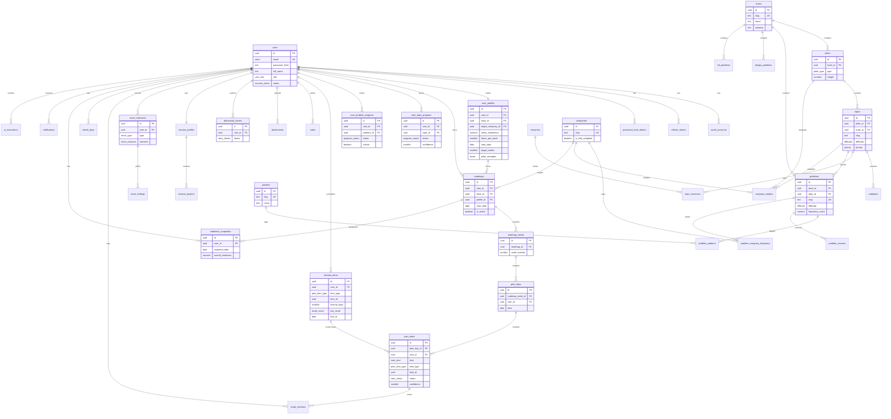

# InterviewOS — Database Schema (04)

**Status:** v1.0 (GA — Backend SDE3)
**Engine:** PostgreSQL 15+ with GORM (Go)
**Scope:** Complete, normalized (3NF) production schema covering every entity in
`01-PRD.md` §8 "Canonical domain model".

This document is the single source of truth for persistence. The OpenAPI spec
(`openapi.yaml`) and API contracts (`05-API-CONTRACTS.md`) use identical field
names and enum values.

---

## 1. Conventions

| Concern | Convention |
|---------|-----------|
| Primary keys | `id UUID PRIMARY KEY DEFAULT gen_random_uuid()` (UUID v4, `pgcrypto`/`gen_random_uuid`). Never expose sequential integers. |
| Naming | `snake_case` for tables (plural) and columns. Join tables named `<a>_<b>` or descriptively (`topic_resources`). |
| Timestamps | Every table has `created_at TIMESTAMPTZ NOT NULL DEFAULT now()` and `updated_at TIMESTAMPTZ NOT NULL DEFAULT now()`. `updated_at` maintained by a `BEFORE UPDATE` trigger (`set_updated_at()`) and by GORM hooks. |
| Soft delete | All **user-data** tables carry `deleted_at TIMESTAMPTZ NULL`. Queries filter `deleted_at IS NULL` (GORM `gorm.DeletedAt`). Seeded **content** tables (tracks, pillars, topics, problems, …) are versioned via migrations and use hard deletes only through migrations; they still carry `deleted_at` where content can be retired without breaking FK history. |
| Foreign keys | All FKs explicit with `ON DELETE` policy. User-owned chains use `ON DELETE CASCADE` from `users`. Content references use `ON DELETE RESTRICT` (content cannot be deleted while referenced) or `ON DELETE SET NULL` for optional links. |
| Enums | Postgres native `ENUM` types (see §3). Adding values uses `ALTER TYPE ... ADD VALUE` migrations. |
| Money/scores | `NUMERIC` for exact scores (readiness 0–100), `INTEGER` for counts, `SMALLINT` for 1–5 confidence. |
| Time spent | Stored in **minutes** as `INTEGER` (`time_spent_minutes`). |
| JSON | Structured-but-flexible content (design-problem sections, AI payloads, intake answers) stored as `JSONB` with GIN indexes where queried. |
| Audit | Mutations on sensitive/user tables append to `audit_logs` (actor, action, entity, before/after JSONB, IP). Triggers for security-sensitive tables (`users`, `oauth_accounts`, `refresh_tokens`); application-level for domain actions. |
| Tenancy | Single-tenant at GA. Every user-owned table carries `user_id` for row scoping and RLS-readiness. |
| Multi-track | All content carries `track_id` (or inherits via parent) so additional tracks need no schema change. |

### Audit strategy

Two layers:
1. **Security audit (trigger-based):** `users`, `oauth_accounts`, `refresh_tokens`,
   `password_reset_tokens` write to `audit_logs` on INSERT/UPDATE/DELETE via the
   `fn_audit()` trigger capturing `before`/`after` row snapshots as JSONB.
2. **Domain audit (application-level):** roadmap generation, task completion,
   revision recall, company-target changes, AI invocations write semantic
   `audit_logs` entries (`action='roadmap.generated'`, etc.) from the service
   layer so the meaning is preserved, not just column diffs.

---

## 2. Entity overview & cardinalities

```
users 1───* oauth_accounts
users 1───* refresh_tokens
users 1───* password_reset_tokens
users 1───1 user_profiles                 (intake; one active profile per user)
users 1───* roadmaps                       (usually one active, history kept)
users 1───* user_topic_progress
users 1───* user_problem_progress
users 1───* revision_items
users 1───* notes
users 1───* attachments
users 1───* behavioral_stories
users 1───1 resume_profiles 1───* resume_projects
users 1───* mock_interviews 1───* mock_findings
users 1───* study_sessions
users 1───* streak_days
users 1───* readiness_snapshots
users 1───* notifications

tracks 1───* pillars 1───* topics 1───* subtopics
topics *───* resources               (via topic_resources)
problems *───* patterns              (via problem_patterns)
problems 1───* problem_sources
problems *───* companies             (via problem_company_frequency)
companies *───* pillars/topics       (via company_weights)
tracks 1───* design_problems
tracks 1───* lld_problems

roadmaps 1───* roadmap_weeks 1───* plan_days 1───* plan_tasks
plan_tasks *───1 (polymorphic item_type,item_id → topic|subtopic|problem|resource|design_problem|lld_problem|behavioral_story|revision_item)
plan_tasks 1───0..1 revision_items   (revise-kind tasks)
```

**Cardinality notes**

- A **user** has exactly one *active* `user_profile` (intake) but the table keeps
  history rows; uniqueness is enforced on `(user_id) WHERE deleted_at IS NULL`.
- A **user** may regenerate roadmaps; only one `roadmaps.is_active = true` per user
  (partial unique index).
- A **plan_task** points to one content item via `(item_type, item_id)`; the same
  content item may appear in many tasks (study then revise).
- A **problem** must map to ≥1 pattern (enforced by seed validation + app check),
  may belong to many source lists, and has 0..* company frequencies.
- **Notes/attachments** are polymorphic over `(owner_type, owner_id)` so they
  attach to tasks, topics, problems, stories, etc.

---

## 3. Enumerated types (Postgres ENUMs)

```sql
CREATE TYPE auth_provider        AS ENUM ('google','github','email');
CREATE TYPE user_role            AS ENUM ('user','admin');
CREATE TYPE account_status       AS ENUM ('active','suspended','deleted');

CREATE TYPE pillar_type          AS ENUM ('dsa','system_design','lld','backend_engineering','behavioral','resume');
CREATE TYPE resource_type        AS ENUM ('book','video','article','course','github','practice','documentation','blog','cheatsheet');
CREATE TYPE difficulty           AS ENUM ('easy','medium','hard');
CREATE TYPE priority             AS ENUM ('low','medium','high','critical');

CREATE TYPE task_kind            AS ENUM ('study','solve','read','watch','revise','mock');
CREATE TYPE task_status          AS ENUM ('pending','in_progress','completed','skipped','rescheduled');
CREATE TYPE plan_item_type       AS ENUM ('topic','subtopic','problem','resource','design_problem','lld_problem','behavioral_story','revision_item');

CREATE TYPE progress_status      AS ENUM ('not_started','in_progress','completed','needs_review');
-- Confidence is NOT an enum: it is a SMALLINT 1–5 domain
--   (`SMALLINT NOT NULL CHECK (col BETWEEN 1 AND 5)`), surfaced as an integer in the API.
CREATE TYPE recall_result        AS ENUM ('correct','incorrect');

CREATE TYPE problem_source_name  AS ENUM ('blind75','neetcode150','grind75','tech_interview_handbook','leetcode_top','striver_sde','custom');
CREATE TYPE problem_platform     AS ENUM ('leetcode','hackerrank','codeforces','interviewbit','gfg','custom');

CREATE TYPE story_theme          AS ENUM ('leadership','ownership','conflict','failure','mentorship','stakeholder_management','project_rescue','production_incident','ambiguity','impact');

CREATE TYPE mock_type            AS ENUM ('coding','system_design','lld','behavioral','backend_engineering');
CREATE TYPE mock_outcome         AS ENUM ('strong_hire','hire','lean_hire','no_hire','strong_no_hire','not_rated');
CREATE TYPE finding_severity     AS ENUM ('info','minor','major','blocker');

CREATE TYPE notification_type    AS ENUM ('today_plan','revision_due','weekly_review','missed_goal','streak_reminder','readiness_milestone','mock_scheduled','system');
CREATE TYPE notification_channel AS ENUM ('in_app','email','push');
CREATE TYPE notification_status  AS ENUM ('unread','read','dismissed');

CREATE TYPE attachment_kind      AS ENUM ('link','file','image');
CREATE TYPE owner_type           AS ENUM ('plan_task','topic','subtopic','problem','design_problem','lld_problem','behavioral_story','mock_interview');

CREATE TYPE ai_feature           AS ENUM ('planner','coach','resume_review','story_improve','weakness_detect','daily_plan','sd_review');
CREATE TYPE ai_invocation_status AS ENUM ('pending','succeeded','failed','fallback');

CREATE TYPE audit_action         AS ENUM (
  'auth.register','auth.login','auth.logout','auth.refresh','auth.password_reset',
  'roadmap.generated','roadmap.rescheduled','task.completed','task.skipped',
  'revision.recalled','company.target_set','profile.updated','ai.invoked','content.updated'
);
```

`difficulty`, `priority` and `recall_result` are shared across
modules so analytics can aggregate uniformly. Confidence is not an enum — it is a
`SMALLINT 1–5` domain (`CHECK (col BETWEEN 1 AND 5)`) surfaced as an integer in the API.

---

## 4. Tables

> Legend — **PK** primary key, **FK** foreign key, **U** unique, **NN** not null.
> All tables include `created_at`, `updated_at` (NN, default `now()`).
> User-data tables additionally include `deleted_at` (NULL).

### 4.1 Identity & configuration

#### `users`
Purpose: canonical account record.

| Column | Type | Null | Default | Notes |
|--------|------|------|---------|-------|
| id | UUID | NN | gen_random_uuid() | **PK** |
| email | CITEXT | NN | | **U** (case-insensitive) |
| email_verified_at | TIMESTAMPTZ | NULL | | |
| password_hash | TEXT | NULL | | bcrypt/argon2; NULL for OAuth-only |
| full_name | TEXT | NULL | | |
| avatar_url | TEXT | NULL | | |
| role | user_role | NN | 'user' | |
| status | account_status | NN | 'active' | |
| last_login_at | TIMESTAMPTZ | NULL | | |
| created_at / updated_at / deleted_at | TIMESTAMPTZ | | | |

Indexes: `UNIQUE(email) WHERE deleted_at IS NULL`; `idx_users_status`.

> The API exposes a derived boolean `email_verified` computed from
> `email_verified_at` (non-NULL ⇒ true); there is no `email_verified` column.

#### `oauth_accounts`
Purpose: linked Google/GitHub identities.

| Column | Type | Null | Default | Notes |
|--------|------|------|---------|-------|
| id | UUID | NN | gen_random_uuid() | **PK** |
| user_id | UUID | NN | | **FK** users(id) ON DELETE CASCADE |
| provider | auth_provider | NN | | |
| provider_user_id | TEXT | NN | | provider's subject id |
| email | CITEXT | NULL | | |
| access_token | TEXT | NULL | | encrypted at rest |
| refresh_token | TEXT | NULL | | encrypted at rest |
| expires_at | TIMESTAMPTZ | NULL | | |
| raw_profile | JSONB | NULL | | |
| created_at / updated_at / deleted_at | | | | |

Indexes: `UNIQUE(provider, provider_user_id)`; `idx_oauth_user (user_id)`.

#### `refresh_tokens`
Purpose: rotating refresh-token store (hashed).

| Column | Type | Null | Default | Notes |
|--------|------|------|---------|-------|
| id | UUID | NN | gen_random_uuid() | **PK** |
| user_id | UUID | NN | | **FK** users(id) ON DELETE CASCADE |
| token_hash | TEXT | NN | | SHA-256 of token; **U** |
| family_id | UUID | NN | | rotation family (reuse detection) |
| user_agent | TEXT | NULL | | |
| ip_address | INET | NULL | | |
| expires_at | TIMESTAMPTZ | NN | | |
| revoked_at | TIMESTAMPTZ | NULL | | |
| replaced_by | UUID | NULL | | **FK** refresh_tokens(id) |
| created_at / updated_at | | | | |

Indexes: `UNIQUE(token_hash)`; `idx_rt_user (user_id)`; `idx_rt_family (family_id)`;
`idx_rt_active (user_id) WHERE revoked_at IS NULL`.

#### `password_reset_tokens`
Purpose: single-use password reset.

| Column | Type | Null | Default | Notes |
|--------|------|------|---------|-------|
| id | UUID | NN | gen_random_uuid() | **PK** |
| user_id | UUID | NN | | **FK** users(id) ON DELETE CASCADE |
| token_hash | TEXT | NN | | **U** |
| expires_at | TIMESTAMPTZ | NN | | |
| used_at | TIMESTAMPTZ | NULL | | |
| created_at / updated_at | | | | |

Indexes: `UNIQUE(token_hash)`; `idx_prt_user (user_id) WHERE used_at IS NULL`.

#### `user_profiles`
Purpose: intake answers driving the Curriculum Engine.

| Column | Type | Null | Default | Notes |
|--------|------|------|---------|-------|
| id | UUID | NN | gen_random_uuid() | **PK** |
| user_id | UUID | NN | | **FK** users(id) ON DELETE CASCADE |
| track_id | UUID | NN | | **FK** tracks(id) ON DELETE RESTRICT |
| years_experience | NUMERIC(4,1) | NN | 0 | |
| target_company_id | UUID | NULL | | **FK** companies(id) ON DELETE SET NULL |
| target_role | TEXT | NN | | e.g. "SDE3 / Senior Backend" |
| target_level | TEXT | NULL | | |
| hours_per_week | SMALLINT | NN | 15 | budget driving plan |
| start_date | DATE | NN | | |
| target_weeks | SMALLINT | NN | 12 | |
| pillar_strengths | JSONB | NN | '{}' | self-assessed `{pillar_type: smallint 1–5}` |
| timezone | TEXT | NN | 'UTC' | |
| onboarding_completed_at | TIMESTAMPTZ | NULL | | |
| intake_answers | JSONB | NN | '{}' | raw wizard payload |
| created_at / updated_at / deleted_at | | | | |

Indexes: `UNIQUE(user_id) WHERE deleted_at IS NULL`; `idx_profile_company (target_company_id)`.

---

### 4.2 Content library (seeded, track-scoped)

#### `tracks`
| Column | Type | Null | Default | Notes |
|--------|------|------|---------|-------|
| id | UUID | NN | gen_random_uuid() | **PK** |
| slug | TEXT | NN | | **U** e.g. `backend-sde3` |
| name | TEXT | NN | | |
| description | TEXT | NULL | | |
| seniority | TEXT | NULL | | SDE1..Staff |
| is_active | BOOLEAN | NN | true | |
| sort_order | INTEGER | NN | 0 | |
| created_at / updated_at / deleted_at | | | | |

Index: `UNIQUE(slug)`.

#### `pillars`
| Column | Type | Null | Default | Notes |
|--------|------|------|---------|-------|
| id | UUID | NN | gen_random_uuid() | **PK** |
| track_id | UUID | NN | | **FK** tracks(id) ON DELETE RESTRICT |
| type | pillar_type | NN | | |
| name | TEXT | NN | | |
| description | TEXT | NULL | | |
| weight | NUMERIC(5,2) | NN | 1.0 | base readiness weight |
| sort_order | INTEGER | NN | 0 | |
| created_at / updated_at / deleted_at | | | | |

Indexes: `UNIQUE(track_id, type)`; `idx_pillar_track (track_id)`.

#### `topics`
| Column | Type | Null | Default | Notes |
|--------|------|------|---------|-------|
| id | UUID | NN | gen_random_uuid() | **PK** |
| pillar_id | UUID | NN | | **FK** pillars(id) ON DELETE RESTRICT |
| track_id | UUID | NN | | denormalized **FK** tracks(id) for fast track filter |
| slug | TEXT | NN | | **U** within track |
| name | TEXT | NN | | |
| summary | TEXT | NULL | | |
| concept_md | TEXT | NULL | | our own summary (markdown) |
| difficulty | difficulty | NN | 'medium' | |
| priority | priority | NN | 'medium' | |
| estimated_hours | NUMERIC(5,2) | NN | 2.0 | |
| common_mistakes | TEXT | NULL | | |
| expected_questions | JSONB | NN | '[]' | |
| prerequisites | JSONB | NN | '[]' | topic ids |
| sort_order | INTEGER | NN | 0 | |
| created_at / updated_at / deleted_at | | | | |

Indexes: `UNIQUE(track_id, slug)`; `idx_topic_pillar (pillar_id)`;
`idx_topic_track_diff (track_id, difficulty)`; GIN `idx_topic_questions (expected_questions)`.

#### `subtopics`
| Column | Type | Null | Default | Notes |
|--------|------|------|---------|-------|
| id | UUID | NN | gen_random_uuid() | **PK** |
| topic_id | UUID | NN | | **FK** topics(id) ON DELETE CASCADE |
| slug | TEXT | NN | | |
| name | TEXT | NN | | |
| content_md | TEXT | NULL | | |
| estimated_hours | NUMERIC(5,2) | NN | 0.5 | |
| sort_order | INTEGER | NN | 0 | |
| created_at / updated_at / deleted_at | | | | |

Index: `UNIQUE(topic_id, slug)`; `idx_subtopic_topic (topic_id)`.

#### `resources`
Purpose: global deduplicated learning resources.

| Column | Type | Null | Default | Notes |
|--------|------|------|---------|-------|
| id | UUID | NN | gen_random_uuid() | **PK** |
| type | resource_type | NN | | |
| title | TEXT | NN | | |
| author | TEXT | NULL | | |
| url | TEXT | NULL | | **U** (where present) |
| provider | TEXT | NULL | | YouTube/O'Reilly/blog domain |
| description | TEXT | NULL | | our summary, not copyrighted text |
| estimated_minutes | INTEGER | NULL | | |
| difficulty | difficulty | NULL | | |
| priority | priority | NN | 'medium' | |
| is_free | BOOLEAN | NN | true | |
| created_at / updated_at / deleted_at | | | | |

Indexes: `UNIQUE(url) WHERE url IS NOT NULL`; `idx_resource_type (type)`.

#### `topic_resources` (M:N)
| Column | Type | Null | Default | Notes |
|--------|------|------|---------|-------|
| id | UUID | NN | gen_random_uuid() | **PK** |
| topic_id | UUID | NN | | **FK** topics(id) ON DELETE CASCADE |
| resource_id | UUID | NN | | **FK** resources(id) ON DELETE RESTRICT |
| relevance | priority | NN | 'medium' | ranking within topic |
| is_primary | BOOLEAN | NN | false | |
| sort_order | INTEGER | NN | 0 | |
| created_at / updated_at | | | | |

Index: `UNIQUE(topic_id, resource_id)`; `idx_tr_resource (resource_id)`.

#### `problems` (DSA canonical, deduplicated)
| Column | Type | Null | Default | Notes |
|--------|------|------|---------|-------|
| id | UUID | NN | gen_random_uuid() | **PK** |
| track_id | UUID | NN | | **FK** tracks(id) ON DELETE RESTRICT |
| topic_id | UUID | NULL | | **FK** topics(id) ON DELETE SET NULL |
| slug | TEXT | NN | | **U** canonical key |
| title | TEXT | NN | | |
| difficulty | difficulty | NN | | |
| platform | problem_platform | NN | 'leetcode' | |
| external_id | TEXT | NULL | | e.g. LeetCode number |
| url | TEXT | NULL | | link-out |
| prompt_summary | TEXT | NULL | | our summary |
| approach_md | TEXT | NULL | | our hints/approach |
| common_mistakes | TEXT | NULL | | |
| estimated_minutes | INTEGER | NN | 30 | |
| frequency_score | NUMERIC(5,2) | NN | 0 | aggregate cross-company |
| is_premium | BOOLEAN | NN | false | |
| created_at / updated_at / deleted_at | | | | |

Indexes: `UNIQUE(slug)`; `idx_problem_topic (topic_id)`;
`idx_problem_track_diff (track_id, difficulty)`; `idx_problem_freq (frequency_score DESC)`.

#### `patterns` (DSA patterns)
| Column | Type | Null | Default | Notes |
|--------|------|------|---------|-------|
| id | UUID | NN | gen_random_uuid() | **PK** |
| track_id | UUID | NN | | **FK** tracks(id) ON DELETE RESTRICT |
| slug | TEXT | NN | | **U** e.g. `sliding-window` |
| name | TEXT | NN | | |
| description | TEXT | NULL | | |
| when_to_use | TEXT | NULL | | |
| sort_order | INTEGER | NN | 0 | |
| created_at / updated_at / deleted_at | | | | |

Index: `UNIQUE(slug)`.

#### `problem_patterns` (M:N)
| Column | Type | Null | Default | Notes |
|--------|------|------|---------|-------|
| id | UUID | NN | gen_random_uuid() | **PK** |
| problem_id | UUID | NN | | **FK** problems(id) ON DELETE CASCADE |
| pattern_id | UUID | NN | | **FK** patterns(id) ON DELETE CASCADE |
| created_at / updated_at | | | | |

Index: `UNIQUE(problem_id, pattern_id)`; `idx_pp_pattern (pattern_id)`.

#### `problem_sources`
Purpose: records each curated list a problem originated from (dedup provenance).

| Column | Type | Null | Default | Notes |
|--------|------|------|---------|-------|
| id | UUID | NN | gen_random_uuid() | **PK** |
| problem_id | UUID | NN | | **FK** problems(id) ON DELETE CASCADE |
| source | problem_source_name | NN | | |
| source_rank | INTEGER | NULL | | position in that list |
| source_url | TEXT | NULL | | |
| created_at / updated_at | | | | |

Index: `UNIQUE(problem_id, source)`; `idx_ps_source (source)`.

#### `design_problems` (HLD / System Design)
| Column | Type | Null | Default | Notes |
|--------|------|------|---------|-------|
| id | UUID | NN | gen_random_uuid() | **PK** |
| track_id | UUID | NN | | **FK** tracks(id) ON DELETE RESTRICT |
| pillar_id | UUID | NULL | | **FK** pillars(id) (system_design) |
| slug | TEXT | NN | | **U** e.g. `url-shortener` |
| title | TEXT | NN | | |
| difficulty | difficulty | NN | | |
| order_index | INTEGER | NN | 0 | catalog ordering (URL Shortener → Uber) |
| requirements_md | TEXT | NULL | | functional + non-functional |
| capacity_estimation_md | TEXT | NULL | | |
| api_design_md | TEXT | NULL | | |
| data_model_md | TEXT | NULL | | |
| high_level_design_md | TEXT | NULL | | |
| caching_md | TEXT | NULL | | |
| queueing_md | TEXT | NULL | | |
| scaling_md | TEXT | NULL | | |
| tradeoffs_md | TEXT | NULL | | |
| failure_handling_md | TEXT | NULL | | |
| alternatives_md | TEXT | NULL | | |
| interview_tips_md | TEXT | NULL | | |
| follow_up_questions | JSONB | NN | '[]' | |
| sections | JSONB | NN | '{}' | extensible section map |
| created_at / updated_at / deleted_at | | | | |

Indexes: `UNIQUE(slug)`; `idx_design_order (track_id, order_index)`.

#### `lld_problems` (Low-Level Design)
| Column | Type | Null | Default | Notes |
|--------|------|------|---------|-------|
| id | UUID | NN | gen_random_uuid() | **PK** |
| track_id | UUID | NN | | **FK** tracks(id) ON DELETE RESTRICT |
| pillar_id | UUID | NULL | | **FK** pillars(id) (lld) |
| slug | TEXT | NN | | **U** e.g. `parking-lot` |
| title | TEXT | NN | | |
| difficulty | difficulty | NN | | |
| order_index | INTEGER | NN | 0 | |
| requirements_md | TEXT | NULL | | |
| entities_md | TEXT | NULL | | classes/objects |
| class_diagram_md | TEXT | NULL | | UML (mermaid/plantuml text) |
| design_patterns | JSONB | NN | '[]' | applied patterns |
| solid_notes_md | TEXT | NULL | | |
| api_or_interface_md | TEXT | NULL | | |
| tradeoffs_md | TEXT | NULL | | |
| follow_up_questions | JSONB | NN | '[]' | |
| created_at / updated_at / deleted_at | | | | |

Indexes: `UNIQUE(slug)`; `idx_lld_order (track_id, order_index)`.

#### `companies`
| Column | Type | Null | Default | Notes |
|--------|------|------|---------|-------|
| id | UUID | NN | gen_random_uuid() | **PK** |
| slug | TEXT | NN | | **U** e.g. `amazon` |
| name | TEXT | NN | | |
| logo_url | TEXT | NULL | | |
| description | TEXT | NULL | | |
| interview_style_md | TEXT | NULL | | LP-heavy etc. |
| is_fully_weighted | BOOLEAN | NN | false | true for Amazon/Google/Uber at GA |
| sort_order | INTEGER | NN | 0 | |
| created_at / updated_at / deleted_at | | | | |

Index: `UNIQUE(slug)`.

#### `company_weights`
Purpose: per-company pillar/topic multipliers that re-rank the roadmap.

| Column | Type | Null | Default | Notes |
|--------|------|------|---------|-------|
| id | UUID | NN | gen_random_uuid() | **PK** |
| company_id | UUID | NN | | **FK** companies(id) ON DELETE CASCADE |
| pillar_id | UUID | NULL | | **FK** pillars(id) ON DELETE CASCADE |
| topic_id | UUID | NULL | | **FK** topics(id) ON DELETE CASCADE |
| weight_multiplier | NUMERIC(5,2) | NN | 1.0 | >1 emphasize, <1 de-emphasize |
| note | TEXT | NULL | | |
| created_at / updated_at | | | | |

Constraints: `CHECK (pillar_id IS NOT NULL OR topic_id IS NOT NULL)`;
`UNIQUE(company_id, pillar_id, topic_id)`.
Indexes: `idx_cw_company (company_id)`; `idx_cw_topic (topic_id)`.

#### `problem_company_frequency`
Purpose: how often a problem is asked at a company.

| Column | Type | Null | Default | Notes |
|--------|------|------|---------|-------|
| id | UUID | NN | gen_random_uuid() | **PK** |
| problem_id | UUID | NN | | **FK** problems(id) ON DELETE CASCADE |
| company_id | UUID | NN | | **FK** companies(id) ON DELETE CASCADE |
| frequency | NUMERIC(5,2) | NN | 0 | 0–100 relative |
| last_seen_period | TEXT | NULL | | e.g. `2025-H2` |
| created_at / updated_at | | | | |

Index: `UNIQUE(problem_id, company_id)`; `idx_pcf_company_freq (company_id, frequency DESC)`.

---

### 4.3 User progress & engine state

#### `roadmaps`
| Column | Type | Null | Default | Notes |
|--------|------|------|---------|-------|
| id | UUID | NN | gen_random_uuid() | **PK** |
| user_id | UUID | NN | | **FK** users(id) ON DELETE CASCADE |
| track_id | UUID | NN | | **FK** tracks(id) ON DELETE RESTRICT |
| profile_id | UUID | NN | | **FK** user_profiles(id) |
| target_company_id | UUID | NULL | | **FK** companies(id) ON DELETE SET NULL |
| start_date | DATE | NN | | |
| end_date | DATE | NN | | |
| total_weeks | SMALLINT | NN | 12 | |
| hours_per_week | SMALLINT | NN | | |
| status | TEXT | NN | 'active' | active/completed/archived |
| is_active | BOOLEAN | NN | true | |
| generation_params | JSONB | NN | '{}' | engine inputs snapshot |
| generated_by | TEXT | NN | 'engine' | engine/ai |
| created_at / updated_at / deleted_at | | | | |

Indexes: `idx_roadmap_user (user_id)`;
`UNIQUE(user_id) WHERE is_active AND deleted_at IS NULL` (one active roadmap).

#### `roadmap_weeks`
| Column | Type | Null | Default | Notes |
|--------|------|------|---------|-------|
| id | UUID | NN | gen_random_uuid() | **PK** |
| roadmap_id | UUID | NN | | **FK** roadmaps(id) ON DELETE CASCADE |
| week_number | SMALLINT | NN | | 1..total_weeks |
| start_date | DATE | NN | | |
| end_date | DATE | NN | | |
| theme | TEXT | NULL | | "Arrays & Hashing + SD intro" |
| focus_pillars | JSONB | NN | '[]' | pillar_type[] |
| planned_hours | NUMERIC(6,2) | NN | 0 | |
| created_at / updated_at / deleted_at | | | | |

Index: `UNIQUE(roadmap_id, week_number)`; `idx_week_roadmap (roadmap_id)`.

#### `plan_days`
| Column | Type | Null | Default | Notes |
|--------|------|------|---------|-------|
| id | UUID | NN | gen_random_uuid() | **PK** |
| roadmap_week_id | UUID | NN | | **FK** roadmap_weeks(id) ON DELETE CASCADE |
| user_id | UUID | NN | | **FK** users(id) ON DELETE CASCADE (scoping) |
| date | DATE | NN | | |
| planned_minutes | INTEGER | NN | 0 | |
| completed_minutes | INTEGER | NN | 0 | |
| is_rest_day | BOOLEAN | NN | false | |
| summary | TEXT | NULL | | |
| created_at / updated_at / deleted_at | | | | |

Indexes: `UNIQUE(roadmap_week_id, date)`; `idx_planday_user_date (user_id, date)`.

#### `plan_tasks`
Purpose: the unified Today list. Polymorphic content reference.

| Column | Type | Null | Default | Notes |
|--------|------|------|---------|-------|
| id | UUID | NN | gen_random_uuid() | **PK** |
| plan_day_id | UUID | NN | | **FK** plan_days(id) ON DELETE CASCADE |
| user_id | UUID | NN | | **FK** users(id) ON DELETE CASCADE |
| kind | task_kind | NN | | study/solve/read/watch/revise/mock |
| item_type | plan_item_type | NN | | polymorphic target type |
| item_id | UUID | NN | | polymorphic target id (no DB FK; app-validated) |
| pillar_type | pillar_type | NN | | denormalized for filtering |
| title | TEXT | NN | | rendered title |
| description | TEXT | NULL | | |
| objectives | JSONB | NN | '[]' | |
| estimated_minutes | INTEGER | NN | 30 | |
| priority | priority | NN | 'medium' | |
| difficulty | difficulty | NULL | | |
| status | task_status | NN | 'pending' | |
| sort_order | INTEGER | NN | 0 | order within day |
| confidence | SMALLINT | NULL | | set on completion; `CHECK (confidence BETWEEN 1 AND 5)` |
| time_spent_minutes | INTEGER | NULL | | |
| completion_notes | TEXT | NULL | | |
| revision_item_id | UUID | NULL | | **FK** revision_items(id) for revise tasks |
| rescheduled_from | UUID | NULL | | **FK** plan_tasks(id) |
| completed_at | TIMESTAMPTZ | NULL | | |
| created_at / updated_at / deleted_at | | | | |

Indexes: `idx_task_day (plan_day_id)`;
`idx_task_user_status (user_id, status)`;
`idx_task_poly (item_type, item_id)`;
`idx_task_user_kind (user_id, kind)`;
`idx_task_pending (user_id, plan_day_id) WHERE status='pending'`.

> **Polymorphism:** `(item_type,item_id)` has no hard FK (cannot reference multiple
> parents). Integrity enforced by the service layer + a periodic validation job;
> `item_type` is constrained to `plan_item_type`. For `plan_tasks` the allowed
> subset is `topic|subtopic|problem|resource|design_problem|lld_problem|behavioral_story|revision_item`
> (all `plan_item_type` values).

#### `user_topic_progress`
| Column | Type | Null | Default | Notes |
|--------|------|------|---------|-------|
| id | UUID | NN | gen_random_uuid() | **PK** |
| user_id | UUID | NN | | **FK** users(id) ON DELETE CASCADE |
| topic_id | UUID | NN | | **FK** topics(id) ON DELETE CASCADE |
| status | progress_status | NN | 'not_started' | |
| confidence | SMALLINT | NULL | | `CHECK (confidence BETWEEN 1 AND 5)` |
| time_spent_minutes | INTEGER | NN | 0 | |
| times_revised | INTEGER | NN | 0 | |
| last_studied_at | TIMESTAMPTZ | NULL | | |
| first_completed_at | TIMESTAMPTZ | NULL | | |
| notes | TEXT | NULL | | |
| created_at / updated_at / deleted_at | | | | |

Index: `UNIQUE(user_id, topic_id) WHERE deleted_at IS NULL`;
`idx_utp_user_status (user_id, status)`; `idx_utp_confidence (user_id, confidence)`.

#### `user_problem_progress`
| Column | Type | Null | Default | Notes |
|--------|------|------|---------|-------|
| id | UUID | NN | gen_random_uuid() | **PK** |
| user_id | UUID | NN | | **FK** users(id) ON DELETE CASCADE |
| problem_id | UUID | NN | | **FK** problems(id) ON DELETE CASCADE |
| status | progress_status | NN | 'not_started' | |
| confidence | SMALLINT | NULL | | `CHECK (confidence BETWEEN 1 AND 5)` |
| attempts | INTEGER | NN | 0 | |
| solved | BOOLEAN | NN | false | |
| time_spent_minutes | INTEGER | NN | 0 | |
| last_attempt_at | TIMESTAMPTZ | NULL | | |
| solved_at | TIMESTAMPTZ | NULL | | |
| notes | TEXT | NULL | | |
| created_at / updated_at / deleted_at | | | | |

Index: `UNIQUE(user_id, problem_id) WHERE deleted_at IS NULL`;
`idx_upp_user_status (user_id, status)`; `idx_upp_solved (user_id, solved)`.

#### `revision_items`
Purpose: spaced-repetition state (1/3/7/15/30-day).

| Column | Type | Null | Default | Notes |
|--------|------|------|---------|-------|
| id | UUID | NN | gen_random_uuid() | **PK** |
| user_id | UUID | NN | | **FK** users(id) ON DELETE CASCADE |
| item_type | plan_item_type | NN | | allowed subset: `topic|problem|design_problem|lld_problem` |
| item_id | UUID | NN | | polymorphic |
| pillar_type | pillar_type | NN | | |
| interval_days | SMALLINT | NN | 1 | current interval (1,3,7,15,30) |
| stage | SMALLINT | NN | 0 | index into interval ladder |
| ease | NUMERIC(4,2) | NN | 2.50 | reserved / inert at GA (stored, not mutated) |
| due_at | DATE | NN | | |
| last_reviewed_at | TIMESTAMPTZ | NULL | | |
| last_recall | recall_result | NULL | | `correct`/`incorrect` |
| review_count | INTEGER | NN | 0 | |
| lapse_count | INTEGER | NN | 0 | |
| is_active | BOOLEAN | NN | true | |
| created_at / updated_at / deleted_at | | | | |

Indexes: `UNIQUE(user_id, item_type, item_id) WHERE deleted_at IS NULL`;
`idx_rev_due (user_id, due_at) WHERE is_active`;
`idx_rev_poly (item_type, item_id)`.

#### `notes`
| Column | Type | Null | Default | Notes |
|--------|------|------|---------|-------|
| id | UUID | NN | gen_random_uuid() | **PK** |
| user_id | UUID | NN | | **FK** users(id) ON DELETE CASCADE |
| owner_type | owner_type | NN | | polymorphic |
| owner_id | UUID | NN | | |
| body_md | TEXT | NN | | |
| pinned | BOOLEAN | NN | false | |
| created_at / updated_at / deleted_at | | | | |

Index: `idx_note_owner (owner_type, owner_id)`; `idx_note_user (user_id)`.

#### `attachments`
| Column | Type | Null | Default | Notes |
|--------|------|------|---------|-------|
| id | UUID | NN | gen_random_uuid() | **PK** |
| user_id | UUID | NN | | **FK** users(id) ON DELETE CASCADE |
| owner_type | owner_type | NN | | polymorphic |
| owner_id | UUID | NN | | |
| kind | attachment_kind | NN | | link/file/image |
| label | TEXT | NULL | | |
| url | TEXT | NN | | object-store URL or external link |
| mime_type | TEXT | NULL | | |
| size_bytes | BIGINT | NULL | | |
| created_at / updated_at / deleted_at | | | | |

Index: `idx_attach_owner (owner_type, owner_id)`; `idx_attach_user (user_id)`.

#### `behavioral_stories`
| Column | Type | Null | Default | Notes |
|--------|------|------|---------|-------|
| id | UUID | NN | gen_random_uuid() | **PK** |
| user_id | UUID | NN | | **FK** users(id) ON DELETE CASCADE |
| title | TEXT | NN | | |
| theme | story_theme | NN | | |
| situation | TEXT | NULL | | STAR |
| task | TEXT | NULL | | STAR |
| action | TEXT | NULL | | STAR |
| result | TEXT | NULL | | STAR |
| metrics | TEXT | NULL | | quantified impact |
| tags | JSONB | NN | '[]' | |
| ai_improved | BOOLEAN | NN | false | |
| ai_feedback | JSONB | NULL | | last story-improve output |
| strength_score | NUMERIC(5,2) | NULL | | 0–100 |
| created_at / updated_at / deleted_at | | | | |

Index: `idx_story_user_theme (user_id, theme)`.

#### `resume_profiles`
| Column | Type | Null | Default | Notes |
|--------|------|------|---------|-------|
| id | UUID | NN | gen_random_uuid() | **PK** |
| user_id | UUID | NN | | **FK** users(id) ON DELETE CASCADE |
| headline | TEXT | NULL | | |
| summary | TEXT | NULL | | |
| years_experience | NUMERIC(4,1) | NULL | | |
| skills | JSONB | NN | '[]' | |
| target_keywords | JSONB | NN | '[]' | ATS keywords |
| ats_score | NUMERIC(5,2) | NULL | | 0–100 |
| last_scored_at | TIMESTAMPTZ | NULL | | |
| ai_feedback | JSONB | NULL | | |
| created_at / updated_at / deleted_at | | | | |

Index: `UNIQUE(user_id) WHERE deleted_at IS NULL`.

#### `resume_projects`
| Column | Type | Null | Default | Notes |
|--------|------|------|---------|-------|
| id | UUID | NN | gen_random_uuid() | **PK** |
| resume_profile_id | UUID | NN | | **FK** resume_profiles(id) ON DELETE CASCADE |
| user_id | UUID | NN | | **FK** users(id) ON DELETE CASCADE |
| name | TEXT | NN | | |
| role | TEXT | NULL | | |
| description | TEXT | NULL | | |
| impact | TEXT | NULL | | |
| metrics | JSONB | NN | '[]' | quantified outcomes |
| tech_stack | JSONB | NN | '[]' | |
| start_date | DATE | NULL | | |
| end_date | DATE | NULL | | |
| sort_order | INTEGER | NN | 0 | |
| created_at / updated_at / deleted_at | | | | |

Index: `idx_rproj_profile (resume_profile_id)`.

#### `mock_interviews`
| Column | Type | Null | Default | Notes |
|--------|------|------|---------|-------|
| id | UUID | NN | gen_random_uuid() | **PK** |
| user_id | UUID | NN | | **FK** users(id) ON DELETE CASCADE |
| type | mock_type | NN | | |
| topic_id | UUID | NULL | | **FK** topics(id) ON DELETE SET NULL |
| design_problem_id | UUID | NULL | | **FK** design_problems(id) ON DELETE SET NULL |
| company_id | UUID | NULL | | **FK** companies(id) ON DELETE SET NULL |
| scheduled_at | TIMESTAMPTZ | NULL | | |
| conducted_at | TIMESTAMPTZ | NULL | | |
| duration_minutes | INTEGER | NULL | | |
| outcome | mock_outcome | NN | 'not_rated' | |
| overall_score | NUMERIC(5,2) | NULL | | 0–100 |
| interviewer | TEXT | NULL | | self/peer/ai |
| transcript_md | TEXT | NULL | | |
| summary | TEXT | NULL | | |
| created_at / updated_at / deleted_at | | | | |

Index: `idx_mock_user_type (user_id, type)`; `idx_mock_conducted (user_id, conducted_at)`.

#### `mock_findings`
Purpose: per-mock weaknesses feeding weakness detection / remediation tasks.

| Column | Type | Null | Default | Notes |
|--------|------|------|---------|-------|
| id | UUID | NN | gen_random_uuid() | **PK** |
| mock_interview_id | UUID | NN | | **FK** mock_interviews(id) ON DELETE CASCADE |
| user_id | UUID | NN | | **FK** users(id) ON DELETE CASCADE |
| pillar_type | pillar_type | NULL | | |
| topic_id | UUID | NULL | | **FK** topics(id) ON DELETE SET NULL |
| severity | finding_severity | NN | 'minor' | |
| category | TEXT | NN | | "communication","correctness",... |
| detail | TEXT | NN | | |
| remediation_task_id | UUID | NULL | | **FK** plan_tasks(id) ON DELETE SET NULL |
| created_at / updated_at / deleted_at | | | | |

Index: `idx_finding_mock (mock_interview_id)`; `idx_finding_user_sev (user_id, severity)`.

#### `study_sessions`
Purpose: time tracking (feeds time-spent heatmap & analytics).

| Column | Type | Null | Default | Notes |
|--------|------|------|---------|-------|
| id | UUID | NN | gen_random_uuid() | **PK** |
| user_id | UUID | NN | | **FK** users(id) ON DELETE CASCADE |
| plan_task_id | UUID | NULL | | **FK** plan_tasks(id) ON DELETE SET NULL |
| pillar_type | pillar_type | NULL | | |
| started_at | TIMESTAMPTZ | NN | | |
| ended_at | TIMESTAMPTZ | NULL | | |
| duration_minutes | INTEGER | NN | 0 | |
| source | TEXT | NN | 'timer' | timer/manual |
| created_at / updated_at / deleted_at | | | | |

Index: `idx_session_user_start (user_id, started_at)`; `idx_session_task (plan_task_id)`.

#### `streak_days`
Purpose: one row per active study day per user (drives streak).

| Column | Type | Null | Default | Notes |
|--------|------|------|---------|-------|
| id | UUID | NN | gen_random_uuid() | **PK** |
| user_id | UUID | NN | | **FK** users(id) ON DELETE CASCADE |
| date | DATE | NN | | |
| tasks_completed | INTEGER | NN | 0 | |
| minutes_studied | INTEGER | NN | 0 | |
| goal_met | BOOLEAN | NN | false | |
| created_at / updated_at / deleted_at | | | | |

Index: `UNIQUE(user_id, date) WHERE deleted_at IS NULL`; `idx_streak_user_date (user_id, date)`.

#### `readiness_snapshots`
Purpose: daily readiness metrics for trend charts & predicted date.

| Column | Type | Null | Default | Notes |
|--------|------|------|---------|-------|
| id | UUID | NN | gen_random_uuid() | **PK** |
| user_id | UUID | NN | | **FK** users(id) ON DELETE CASCADE |
| roadmap_id | UUID | NULL | | **FK** roadmaps(id) ON DELETE SET NULL |
| snapshot_date | DATE | NN | | |
| overall_readiness | NUMERIC(5,2) | NN | 0 | 0–100 |
| pillar_readiness | JSONB | NN | '{}' | `{pillar_type: score}` |
| completion_pct | NUMERIC(5,2) | NN | 0 | |
| avg_confidence | NUMERIC(4,2) | NULL | | |
| revision_health | NUMERIC(5,2) | NULL | | on-time revision % |
| estimated_ready_date | DATE | NULL | | predicted offer-readiness |
| weak_topics | JSONB | NN | '[]' | topic ids |
| strong_topics | JSONB | NN | '[]' | topic ids |
| created_at / updated_at / deleted_at | | | | |

Index: `UNIQUE(user_id, snapshot_date) WHERE deleted_at IS NULL`;
`idx_snap_user_date (user_id, snapshot_date DESC)`.

#### `notifications`
| Column | Type | Null | Default | Notes |
|--------|------|------|---------|-------|
| id | UUID | NN | gen_random_uuid() | **PK** |
| user_id | UUID | NN | | **FK** users(id) ON DELETE CASCADE |
| type | notification_type | NN | | |
| channel | notification_channel | NN | 'in_app' | |
| status | notification_status | NN | 'unread' | |
| title | TEXT | NN | | |
| body | TEXT | NULL | | |
| payload | JSONB | NN | '{}' | deep-link data |
| read_at | TIMESTAMPTZ | NULL | | |
| created_at / updated_at / deleted_at | | | | |

Index: `idx_notif_user_status (user_id, status)`;
`idx_notif_unread (user_id) WHERE status='unread'`.

#### `ai_invocations`
Purpose: log/cache of AI feature calls (planner/coach/reviewers) for graceful
fallback, cost tracking, and idempotency.

| Column | Type | Null | Default | Notes |
|--------|------|------|---------|-------|
| id | UUID | NN | gen_random_uuid() | **PK** |
| user_id | UUID | NN | | **FK** users(id) ON DELETE CASCADE |
| feature | ai_feature | NN | | |
| status | ai_invocation_status | NN | 'pending' | |
| idempotency_key | TEXT | NULL | | dedup repeated requests |
| request | JSONB | NN | '{}' | |
| response | JSONB | NULL | | |
| model | TEXT | NULL | | claude model id |
| input_tokens | INTEGER | NULL | | |
| output_tokens | INTEGER | NULL | | |
| latency_ms | INTEGER | NULL | | |
| error | TEXT | NULL | | |
| used_fallback | BOOLEAN | NN | false | |
| created_at / updated_at / deleted_at | | | | |

Index: `idx_ai_user_feature (user_id, feature)`;
`UNIQUE(user_id, feature, idempotency_key) WHERE idempotency_key IS NOT NULL`.

#### `audit_logs`
| Column | Type | Null | Default | Notes |
|--------|------|------|---------|-------|
| id | UUID | NN | gen_random_uuid() | **PK** |
| actor_user_id | UUID | NULL | | **FK** users(id) ON DELETE SET NULL |
| action | audit_action | NN | | |
| entity_type | TEXT | NULL | | table name |
| entity_id | UUID | NULL | | |
| before | JSONB | NULL | | row snapshot |
| after | JSONB | NULL | | row snapshot |
| ip_address | INET | NULL | | |
| user_agent | TEXT | NULL | | |
| created_at | TIMESTAMPTZ | NN | now() | append-only (no updated_at/deleted_at) |

Index: `idx_audit_actor (actor_user_id)`; `idx_audit_entity (entity_type, entity_id)`;
`idx_audit_action_time (action, created_at DESC)`. Partitioned monthly by `created_at` (range partition) for retention.

---

## 5. ER diagram (core entities)



The standalone diagram is saved at `docs/diagrams/er-diagram.mmd`.

---

## 6. Indexing & performance strategy

- **Hot path — "Today":** `plan_tasks` partial index `WHERE status='pending'`
  keyed by `(user_id, plan_day_id)`, plus `plan_days` `UNIQUE(roadmap_week_id, date)`
  and `idx_planday_user_date (user_id, date)` make the Today query a single index
  range scan. Target p99 < 300 ms.
- **Revision due query:** `idx_rev_due (user_id, due_at) WHERE is_active` answers
  "due today/overdue" with a covering range scan.
- **Content browse/filter:** composite indexes `(track_id, difficulty)` on topics &
  problems; `idx_problem_freq (frequency_score DESC)` and
  `idx_pcf_company_freq (company_id, frequency DESC)` power company/difficulty
  filters and "most-asked" sorts without sequential scans.
- **Search:** full-text `GIN` indexes (`to_tsvector`) on `topics.name||summary`,
  `problems.title`, `design_problems.title`, `resources.title` for `q=` search
  (created in a dedicated migration). `pg_trgm` for fuzzy slug/title match.
- **JSONB:** GIN on frequently-filtered JSONB (`topics.expected_questions`,
  `readiness_snapshots.pillar_readiness`).
- **Analytics:** `readiness_snapshots (user_id, snapshot_date DESC)`,
  `study_sessions (user_id, started_at)`, `streak_days (user_id, date)` support
  trend/heatmap aggregations.
- **Audit volume:** `audit_logs` range-partitioned monthly on `created_at`; old
  partitions detached/archived per retention policy.
- **Connection/scale:** read-heavy endpoints can target a read replica; pgbouncer
  in transaction mode. Covering/partial indexes preferred over wide indexes.

## 7. Soft-delete & audit approach

- **Soft delete:** user-data tables use `deleted_at`; GORM models embed
  `gorm.DeletedAt`. All unique constraints on user data are partial
  (`WHERE deleted_at IS NULL`) so a soft-deleted row never blocks recreation.
  Content tables retire rows via `deleted_at` but are primarily migration-managed.
- **Cascade vs restrict:** deleting a `user` cascades all owned rows. Content
  referenced by user progress uses `ON DELETE RESTRICT`; optional content links use
  `ON DELETE SET NULL` so historical progress survives content churn.
- **Audit:** `fn_audit()` trigger on security tables + service-layer semantic
  events into `audit_logs`. Append-only, partitioned, never soft-deleted.

## 8. Migration strategy (golang-migrate)

Ordered, immutable, paired `*.up.sql` / `*.down.sql` files under `db/migrations/`:

```
000001_extensions.up.sql            -- pgcrypto, citext, pg_trgm
000002_enums.up.sql                 -- all ENUM types (§3)
000003_audit_infra.up.sql           -- audit_logs (+ partitions), fn_audit, set_updated_at
000004_identity.up.sql              -- users, oauth_accounts, refresh_tokens,
                                    --   password_reset_tokens, user_profiles
000005_content_taxonomy.up.sql      -- tracks, pillars, topics, subtopics
000006_resources.up.sql             -- resources, topic_resources
000007_dsa.up.sql                   -- problems, patterns, problem_patterns,
                                    --   problem_sources
000008_companies.up.sql             -- companies, company_weights,
                                    --   problem_company_frequency
000009_design_lld.up.sql            -- design_problems, lld_problems
000010_roadmap.up.sql               -- roadmaps, roadmap_weeks, plan_days, plan_tasks
000011_progress.up.sql              -- user_topic_progress, user_problem_progress
000012_revision.up.sql              -- revision_items
000013_notes_attachments.up.sql     -- notes, attachments
000014_behavioral_resume.up.sql     -- behavioral_stories, resume_profiles,
                                    --   resume_projects
000015_mocks.up.sql                 -- mock_interviews, mock_findings
000016_analytics.up.sql             -- study_sessions, streak_days,
                                    --   readiness_snapshots
000017_notifications_ai.up.sql      -- notifications, ai_invocations
000018_search_indexes.up.sql        -- tsvector / pg_trgm / GIN indexes
000019_triggers.up.sql              -- attach set_updated_at + fn_audit triggers
```

- Migrations run in CI and on deploy; never edited after merge — new changes get a
  new numbered file. `down` migrations are reversible for the latest N.
- ENUM value additions use a dedicated `ALTER TYPE ... ADD VALUE` migration
  (non-transactional handling noted in the file header).

## 9. Seed-data plan

Seed scripts live in `db/seed/` and are versioned with the schema. Seeding order
mirrors FK dependencies. **GA seeds DSA + System Design first** (PRD §12, M1).

| Phase | Tables seeded | Content |
|-------|---------------|---------|
| Core | `tracks` | `backend-sde3` |
| Core | `pillars` | 6 pillars for the track |
| Core | `companies` + `company_weights` | 10 companies; Amazon/Google/Uber fully weighted, rest scaffolded |
| **M1** | `patterns` | DSA patterns (sliding window, two pointers, BFS/DFS, DP, …) |
| **M1** | `topics`,`subtopics` (DSA + System Design pillars) | DSA topics + SD topics/theory |
| **M1** | `problems`,`problem_patterns`,`problem_sources`,`problem_company_frequency` | Canonical DSA set deduped from Blind75/NeetCode150/Grind75/THB |
| **M1** | `resources`,`topic_resources` | Deduped global resources for DSA + SD |
| **M1** | `design_problems` | URL Shortener → Uber catalog (ordered) |
| M3 | `topics`/`subtopics`/`resources` (Backend Engineering, LLD, Behavioral) | depth modules |
| M3 | `lld_problems` | Parking Lot, BookMyShow, Splitwise, … |

Seed invariants validated by a `seed-verify` job: every `problem` maps to ≥1
`pattern`; no duplicate canonical `problem.slug`; every `topic` belongs to a pillar
within its `track_id`; `design_problems.order_index` is contiguous per track.
