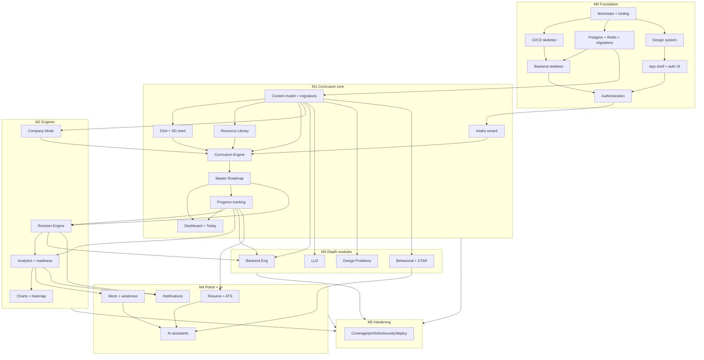
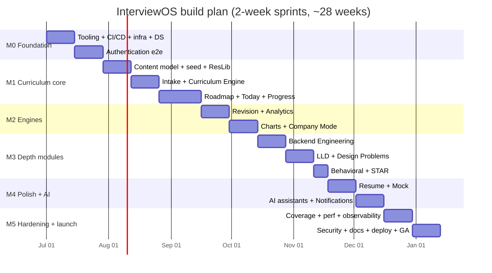

# InterviewOS — Development Roadmap & Milestones

**Status:** Draft v1.0
**Owner:** Engineering (EM + Staff)
**Last updated:** 2026-06-29
**Track at GA:** Backend SDE3
**Companion to:** `01-PRD.md` (Section 11 release plan, Section 7 feature priorities)

---

## 0. How to read this document

This is the **implementation plan engineering follows**. It expands the PRD's M0–M5
outline into a concrete, sequenced build plan. Work proceeds **feature-by-feature**;
within each feature the team executes a fixed **7-step order** (below). We ship the
**Backend SDE3 vertical fully** before adding breadth (per PRD §12 scope-creep
mitigation). Priorities map directly to PRD §7 (**P0** = GA-blocking, **P1** =
GA-desirable, **P2** = post-GA).

### Monorepo layout (reference for all file paths below)

```
interviewos/
├── Makefile                      # dev/test/build/migrate/seed/lint targets (repo root)
├── backend/
│   ├── Dockerfile                # backend image
│   ├── cmd/                      # api, migrate, seed entrypoints
│   │   ├── api/main.go           # Gin entrypoint
│   │   ├── migrate/              # migration runner
│   │   └── seed/                 # seed loader
│   ├── internal/
│   │   ├── platform/             # server (router, middleware, health, swagger), database
│   │   ├── auth/                 # auth domain (handler/service/repo)
│   │   ├── user/                 # user domain
│   │   ├── intake/               # intake + profile
│   │   ├── curriculum/           # curriculum engine
│   │   ├── roadmap/              # roadmap/week/day/task
│   │   ├── progress/             # topic/problem progress, sessions, streaks
│   │   ├── content/              # track/pillar/topic/resource/problem/...
│   │   ├── dsa/  systemdesign/  lld/  designproblems/  backendeng/
│   │   ├── behavioral/  resume/  mock/
│   │   ├── revision/             # spaced-repetition engine
│   │   ├── analytics/            # readiness model + snapshots
│   │   ├── company/              # company mode weighting
│   │   ├── notification/         # in-app notifications
│   │   └── ai/                   # Claude API client + assistants
│   ├── pkg/config/               # env/config loader
│   ├── migrations/               # NNNN_name.up.sql / .down.sql (goose/golang-migrate)
│   ├── seed/<module>/            # structured seed data (yaml) per module
│   └── api/openapi.yaml          # source-of-truth OpenAPI 3.1 spec
├── frontend/
│   ├── Dockerfile                # frontend image
│   ├── app/                      # Next.js App Router (routes/layouts)
│   ├── features/<feature>/       # components + hooks + api clients (React Query)
│   ├── components/ui/            # shadcn primitives
│   ├── lib/                      # api client, query client, auth, theme
│   └── tests/                    # vitest + playwright e2e
├── infra/
│   ├── docker-compose.yml        # postgres, redis, backend, frontend, mailhog (dev-only)
│   ├── nginx/  k8s/  helm/        # (k8s/helm optional)
│   └── terraform/                # optional
├── .github/workflows/            # ci.yml, docker.yml, deploy.yml
└── docs/                         # 01-PRD … 07-ROADMAP, OpenAPI rendered, ADRs
```

---

## 1. Guiding principles & Definition of Done

### 1.1 Engineering principles

- **Deterministic core, AI augments.** The Curriculum, Revision, and Analytics
  engines are deterministic and are the source of truth. AI is optional, cached,
  and **degrades gracefully** to a deterministic fallback (PRD §7.18, §9).
- **Clean architecture per module.** Each `internal/<module>` is layered:
  `handler` (HTTP/DTO) → `service` (business rules) → `repository` (data access)
  → `model`. Dependencies point inward; handlers never touch SQL; services depend
  on repository **interfaces**, not concrete types (SOLID: D & I).
- **Track-scoped from day one.** All content carries `track_id`; nothing hardcodes
  "Backend SDE3" (PRD §1, §9 multi-track decision).
- **Polymorphic plan tasks.** `PlanTask(item_type, item_id, kind)` powers a single
  unified Today list (PRD §8, §9).
- **No TODOs in merged code.** Every shipped path is complete and production-grade.
- **Migrations are forward-only history.** Every schema change is a paired
  `.up.sql`/`.down.sql`; seed data is versioned and idempotent.
- **API is contract-first.** `backend/api/openapi.yaml` is updated **with** the
  handler in the same PR; Swagger UI is served live at `/swagger`.

### 1.2 The 7-step build order (every feature, in order)

| # | Step | What it produces |
|---|------|------------------|
| 1 | **Design** | Short design note / ADR: domain model delta, interfaces, sequence, edge cases, acceptance criteria traced to PRD §7 |
| 2 | **Database** | Migration(s) up/down + idempotent seed + repository tests |
| 3 | **Backend** | Service layer (business rules), domain models, validation, errors |
| 4 | **API** | Gin handlers, DTOs, routing, middleware; `openapi.yaml` updated; Swagger live |
| 5 | **Frontend** | Route + feature components wired via React Query hooks; loading/error/empty states |
| 6 | **Tests** | Unit (service), integration (handler+db), repository, frontend component + e2e |
| 7 | **Documentation** | Feature doc/ADR, README updates, OpenAPI rendered, changelog entry |

### 1.3 Definition of Done (per feature) — all must be true

- [ ] Design note merged; acceptance criteria copied from PRD §7 and satisfied.
- [ ] **Migrations** (up **and** down) + **idempotent seed** committed and applied in CI.
- [ ] **Backend**: service implements the spec; no TODOs; errors typed & wrapped.
- [ ] **Unit + integration + repository tests pass**; coverage meets gate (§7).
- [ ] **OpenAPI updated**; spec lints; **Swagger UI live** and reflects new endpoints.
- [ ] **Frontend wired with React Query**: loading/error/empty handled, optimistic
      updates where the PRD requires no full reload (e.g. Today completion, §7.3).
- [ ] **a11y**: keyboard-navigable, focus management, ARIA labels, axe checks pass.
- [ ] **Dark mode**: renders correctly via design tokens in both themes.
- [ ] **Docs updated**: feature doc, OpenAPI render, ADR if a decision was made.
- [ ] **CI green**: lint + format + unit + integration + build + docker all pass.

---

## 2. Milestone plan (M0–M5)

> Durations assume a small senior team (≈3–4 engineers). Total: **~28 weeks**.
> Sprints are 2 weeks (§5). Cut-line guidance in §8 governs what slips first.

### M0 — Foundation **(P0)** · ~4 weeks · Sprints S1–S2

**Goal:** A bootable, observable, deployable skeleton with **Authentication working
end-to-end**, so every later feature drops into a ready harness.

**Epics / features (ordered):**
1. **Monorepo + tooling** — `Makefile` (repo root), `infra/docker-compose.yml`
   (Postgres, Redis, backend, frontend, MailHog — MailHog is a **dev-only** mail
   catcher and does not change the in-app-only GA notification default), lint/format
   (golangci-lint, gofmt; ESLint, Prettier).
2. **CI/CD skeleton** — `.github/workflows/ci.yml` (lint → test → build → docker),
   caching, status checks; `docker.yml` builds & pushes images.
3. **Data infra** — Postgres + Redis connection pools (`internal/platform/db`,
   `/cache`); migration tooling (golang-migrate) wired into Make + CI.
4. **Design-system bootstrap** — Tailwind + shadcn/ui + design tokens (color,
   spacing, radius, typography) with light/dark token sets.
5. **Frontend app shell** — Next.js App Router, root layout, theme provider,
   React Query provider, auth UI shell (login/signup/forgot routes).
6. **Backend skeleton** — Gin server, config loader, structured logging (zap/slog),
   `/healthz` + `/readyz`, request-id + recovery + CORS middleware, Swagger mount.
7. **Authentication (P0, §7.1)** — Google + GitHub OAuth, email/password, JWT
   access + **rotating refresh tokens**, forgot-password with email reset tokens.

**Key deliverables:** running `make dev` brings up the full stack; sign-up/login via
all three methods; refresh keeps sessions alive; password reset email lands in
MailHog; Swagger lists auth endpoints; CI green on a real PR.

**Exit criteria:**
- `make dev` boots stack; `make migrate` + `make seed` succeed from clean DB.
- A user signs up via Google **and** GitHub **and** email, stays logged in across
  a token expiry via refresh, and completes a forgot-password reset (PRD §7.1 AC).
- CI runs lint+test+build+docker on PR and blocks merge on failure.
- Health/readiness endpoints + structured logs + Swagger UI live.

**Risks → mitigation (PRD §12):** OAuth provider config drift → store provider
secrets in env + document setup; refresh-token rotation bugs → integration tests
for rotate/replay/revoke before any other feature builds on auth.

---

### M1 — Curriculum core **(P0)** · ~7 weeks · Sprints S3–S5

**Goal:** The product's north-star loop works: intake → 12-week roadmap → daily
"Today" plan → log progress. DSA + System Design content seeded.

**Epics / features (ordered):**
1. **Content domain model + migrations** — `Track, Pillar, Topic, Subtopic,
   Resource, TopicResource, Problem, Pattern, ProblemPattern, ProblemSource`
   (PRD §8). Track-scoped.
2. **DSA & System Design seed data** — canonical, **deduplicated** DSA problem set
   (Blind75/NeetCode150/Grind75/THB merged) + SD topics (PRD §7.5, §7.6, §7.15).
3. **Resource Library (§7.15)** — global deduplicated resources; M:N to topics.
4. **Intake wizard (§7.2)** — captures experience, target company, role/level,
   hours/week, start date, self-assessed pillar strengths → `UserProfile`.
5. **Curriculum Engine (§7.2)** — deterministic generation of an ordered, dated
   12-week roadmap; respects weekly hour budget (≤+10%) and company weighting.
6. **Master Roadmap (§7.4)** — `Roadmap → RoadmapWeek → PlanDay → PlanTask`
   (polymorphic); week/day/task views; reschedule/skip.
7. **Dashboard + Today view (§7.3)** — Today task list with one-tap completion
   (optimistic, no full reload); readiness/streak placeholders wired.
8. **Progress tracking (§7.4)** — `UserTopicProgress`, `UserProblemProgress`
   (status, confidence 1–5, time, notes); `StudySession` time logging.

**Key deliverables:** submitting intake produces a full 12-week roadmap with a
non-empty Today plan for the start date; tasks completable with confidence/time/notes;
DSA filtering by pattern/difficulty/company works; no duplicate canonical problems.

**Exit criteria (trace PRD §7.2–§7.5 AC):**
- Intake → full 12-week roadmap; weekly hours never exceed budget by >10%.
- Today plan non-empty for start date; completing a task updates UI without reload.
- DSA: every problem maps to ≥1 pattern; zero duplicate canonical problems;
  filters work.
- Reschedule moves incomplete tasks forward correctly.

**Risks → mitigation:** content curation volume (PRD §12) → seed **DSA+SD first**,
strict structured seed format in `backend/seed/`, expand later milestones; engine
overfilling days → property test that asserts the ≤+10% budget invariant.

---

### M2 — Engines **(P0)** · ~4 weeks · Sprints S6–S7

**Goal:** The adaptive intelligence: spaced repetition, readiness analytics, and
company-aware re-weighting.

**Epics / features (ordered):**
1. **Revision Engine (§7.13)** — `RevisionItem` (interval, due_at, ease,
   last_recall); intervals **1/3/7/15/30**; completing a topic schedules +1;
   correct recall advances, incorrect resets to +1; due items surface in Today.
2. **Analytics + readiness model (§7.16)** — weighted per-pillar coverage ×
   confidence × revision health → Overall + per-pillar readiness; weakest/strongest
   topics; streak; **daily `ReadinessSnapshot`**; predicted readiness date.
3. **Charts & heatmap** — readiness-over-time line, time-spent calendar heatmap,
   pillar radar on the dashboard (PRD §7.3).
4. **Company Mode (§7.14)** — `Company`, `CompanyWeight`,
   `ProblemCompanyFrequency`; weights re-rank the roadmap; **engine + 3 companies
   fully weighted** (Amazon/Google/Uber), rest scaffolded (PRD §13 OQ3 default).

**Key deliverables:** completing a topic creates a +1 revision task; recall advances
intervals; dashboard shows real readiness with explanation; switching target company
re-ranks the plan.

**Exit criteria:** Revision AC (PRD §7.13) holds via tests; readiness is explainable
and reproducible from snapshots; Company Mode changes ranking deterministically.

**Risks → mitigation:** readiness mis-calibration (PRD §12) → weights are
**config-driven** and the model exposes a per-component explanation; iterate later.

---

### M3 — Depth modules **(P0)** · ~5 weeks · Sprints S8–S10

**Goal:** Fill out the remaining P0 pillars with seeded content and module UIs.

**Epics / features (ordered):**
1. **Backend Engineering module (§7.7)** — depth topics (Kafka, Redis, SQL/NoSQL,
   txns, MVCC, indexes, replication, partitioning, CAP, consensus, LB, Docker/K8s,
   networking, Linux, concurrency, Go runtime); reuses content model + progress.
2. **LLD module (§7.8)** — SOLID, patterns, UML; `LLDProblem` set (Parking Lot,
   BookMyShow, Splitwise, Elevator, Chess, Food Delivery, Ride Sharing).
3. **Design Problems module (§7.9)** — `DesignProblem` ordered catalog with
   structured sections (requirements, capacity, API, schema, caching, scaling…).
4. **Behavioral module + STAR builder (§7.10)** — `BehavioralStory` (STAR fields)
   across themes; deterministic completeness checks (AI improver lands in M4).

**Key deliverables:** each module browsable, integrated into roadmap/progress/
revision; STAR stories saved with validation.

**Exit criteria:** all four modules seeded and wired to progress + revision + Today;
each contributes to its pillar's readiness.

**Risks → mitigation:** content breadth (PRD §12) → structured seed reused from M1;
cut depth per §8 if behind, never cut the module's data model.

---

### M4 — Polish & AI **(P1)** · ~4 weeks · Sprints S11–S12

**Goal:** GA-desirable layer: resume/mock tooling, AI assistants, notifications.

**Epics / features (ordered):**
1. **Resume module (§7.11)** — `ResumeProfile`/`ResumeProject`; impact/metrics
   builder; **ATS keyword/scoring** (deterministic scorer).
2. **Mock Interview module (§7.12)** — `MockInterview` + `MockFinding`; records
   coding/SD/behavioral results; **weakness detection** → remediation tasks into
   the roadmap, feeding analytics.
3. **AI assistants (§7.18, Claude API)** — planner, coach, resume reviewer, story
   improver, weakness detector, daily planner, system-design reviewer; in
   `internal/ai`; **cached + graceful deterministic fallback** when disabled.
4. **Notifications (§7.17)** — `Notification`; today's tasks, revision due, weekly
   review, missed goals, streak reminders; **in-app at GA** (email post-GA, OQ2).

**Key deliverables:** resume ATS score; mock results generate remediation tasks;
each AI assistant works behind a feature flag with a tested fallback path;
in-app notifications fire on the defined triggers.

**Exit criteria:** AI features degrade gracefully (flag off → deterministic path,
tested); mock weaknesses appear as roadmap tasks; ATS scoring returns keyword gaps.

**Risks → mitigation:** AI cost/latency/unreliability (PRD §12) → response caching,
timeouts + fallback, never block the deterministic engine; budget guardrails on the
Claude client.

---

### M5 — Hardening & launch **(P0 to ship)** · ~4 weeks · Sprints S13–S14

**Goal:** Meet NFR SLOs, lock down security, complete docs, deploy, GA.

**Epics / features (ordered):**
1. **Test coverage to targets** — close gaps to gates in §7; flaky-test triage.
2. **Performance tuning to NFR SLOs** — Dashboard p95 < 2s, read API p99 < 300ms
   (PRD §10); query/index review, caching, N+1 elimination, load tests.
3. **Observability** — structured logs, Prometheus metrics, OpenTelemetry traces,
   dashboards, alerts; crash-free ≥ 99.5% tracking.
4. **Security review** — authz on every endpoint, token rotation/revocation,
   rate limiting, input validation, secrets handling, dependency scan, OWASP pass.
5. **Full documentation set** — finalize `02-SRS`, `04-DATABASE-SCHEMA`, OpenAPI
   render, ADRs, runbooks, onboarding README.
6. **Deployment** — production Dockerfiles (`backend/Dockerfile`, `frontend/Dockerfile`),
   `deploy.yml`; **K8s/Helm optional** (`infra/`); **Terraform optional** (`infra/terraform/`);
   env config, migrations-on-deploy, rollback plan.
7. **GA cutover.**

**Key deliverables:** SLOs verified under load; security checklist signed off;
docs complete; one-command (or pipeline) deploy with rollback.

**Exit criteria:** all P0 acceptance criteria from PRD §7 pass; SLOs met in staging
load test; security review closed; CI/CD deploys to production; GA sign-off.

**Risks → mitigation:** late perf surprises → run a perf smoke each milestone, not
only M5; security debt → security checks in CI from M0.

---

### Milestone summary

| Milestone | Theme | Priority | Sprints | Weeks |
|-----------|-------|----------|---------|-------|
| M0 | Foundation + Auth | P0 | S1–S2 | 4 |
| M1 | Curriculum core | P0 | S3–S5 | 7 |
| M2 | Engines | P0 | S6–S7 | 4 |
| M3 | Depth modules | P0 | S8–S10 | 5 |
| M4 | Polish & AI | P1 | S11–S12 | 4 |
| M5 | Hardening & launch | P0-to-ship | S13–S14 | 4 |
| **Total** | | | **14 sprints** | **~28 weeks** |

---

## 3. Feature-by-feature build checklist (first 8 features)

Each table breaks the **7 steps** into concrete tasks with the files/packages
touched. Steps run **in order**; the feature is Done only when §1.3 holds.

### 3.1 Authentication (M0, P0, §7.1)

| Step | Tasks | Files / packages |
|------|-------|------------------|
| 1 Design | Token model (access+rotating refresh), OAuth flow, reset-token flow, threat notes | `docs/adr/0001-auth.md` |
| 2 Database | `users, oauth_accounts, refresh_tokens, password_reset_tokens`; repo tests | `backend/migrations/0001_auth.{up,down}.sql`, `internal/auth/repository.go` |
| 3 Backend | Register/login/refresh/rotate/revoke, OAuth code exchange, reset issue/consume; bcrypt; JWT sign/verify; mailer | `internal/auth/service.go`, `internal/platform/jwt`, `internal/platform/mailer` |
| 4 API | `POST /auth/register,/auth/login,/auth/refresh,/auth/logout,/auth/forgot-password,/auth/reset-password`, `GET /auth/oauth/{provider}/callback`; auth middleware; OpenAPI | `internal/auth/handler.go`, `internal/platform/server/router.go`, `api/openapi.yaml` |
| 5 Frontend | Login/signup/forgot/reset routes; OAuth buttons; token store + refresh interceptor; React Query mutations | `frontend/app/(auth)/*`, `features/auth/*`, `lib/api.ts`, `lib/auth.ts` |
| 6 Tests | Service unit, handler integration (rotate/replay/revoke), repo; e2e signup→login→refresh→reset | `internal/auth/*_test.go`, `frontend/tests/auth.spec.ts` |
| 7 Docs | Auth doc, env setup (OAuth secrets), OpenAPI render | `docs/features/auth.md`, README |

### 3.2 Intake wizard (M1, P0, §7.2)

| Step | Tasks | Files / packages |
|------|-------|------------------|
| 1 Design | `UserProfile` fields; multi-step wizard UX; validation rules | `docs/adr/0002-intake.md` |
| 2 Database | `user_profiles` (experience, target_company_id, role/level, hours_week, start_date, pillar self-assessment); repo tests | `backend/migrations/0010_intake.{up,down}.sql`, `internal/intake/repository.go` |
| 3 Backend | Validate + persist intake; emit "profile ready" to trigger curriculum gen | `internal/intake/service.go`, `internal/intake/model.go` |
| 4 API | `GET /profile`, `PUT /profile`; OpenAPI | `internal/intake/handler.go`, `api/openapi.yaml` |
| 5 Frontend | Multi-step wizard, progress bar, per-step validation, review screen | `frontend/app/(app)/intake/*`, `features/intake/*` |
| 6 Tests | Validation units; handler integration; e2e wizard completion | `internal/intake/*_test.go`, `frontend/tests/intake.spec.ts` |
| 7 Docs | Intake field reference + AC trace | `docs/features/intake.md` |

### 3.3 Curriculum Engine (M1, P0, §7.2)

| Step | Tasks | Files / packages |
|------|-------|------------------|
| 1 Design | Generation algorithm: budget allocation, pillar ordering, company weighting, day packing, ≤+10% invariant | `docs/adr/0003-curriculum-engine.md` |
| 2 Database | Read content + weights (from §3.6/§3.8); writes via Roadmap (§3.4) | uses `internal/content`, `internal/company` repos |
| 3 Backend | Pure deterministic generator + planner; hour-budget solver; reschedule logic; unit-testable, no I/O in core | `internal/curriculum/engine.go`, `planner.go`, `service.go` |
| 4 API | `POST /roadmaps/generate` (regenerate = body flag, not a separate path); OpenAPI | `internal/curriculum/handler.go`, `api/openapi.yaml` |
| 5 Frontend | "Generate plan" step post-intake; generation progress + result summary | `features/curriculum/*` |
| 6 Tests | Property tests (budget ≤+10%, every day non-empty, deterministic), integration | `internal/curriculum/engine_test.go` |
| 7 Docs | Engine algorithm doc + tunables | `docs/features/curriculum-engine.md` |

### 3.4 Master Roadmap (M1, P0, §7.4)

| Step | Tasks | Files / packages |
|------|-------|------------------|
| 1 Design | `Roadmap→Week→Day→PlanTask` schema; polymorphic `(item_type,item_id,kind)`; reschedule/skip semantics | `docs/adr/0004-roadmap.md` |
| 2 Database | `roadmaps, roadmap_weeks, plan_days, plan_tasks`; indexes on (user, date); repo tests | `backend/migrations/0011_roadmap.{up,down}.sql`, `internal/roadmap/repository.go` |
| 3 Backend | CRUD, reschedule-forward, skip, day/week aggregation | `internal/roadmap/service.go`, `model.go` |
| 4 API | `GET /roadmaps/active`, `GET /roadmaps/{roadmapId}/weeks/{weekNumber}`, `GET /plan-days/{date}`, `POST /tasks/{taskId}/reschedule`, `POST /tasks/{taskId}/skip`; OpenAPI | `internal/roadmap/handler.go`, `api/openapi.yaml` |
| 5 Frontend | Week→Day→Task views; reschedule UI; task detail panel | `frontend/app/(app)/roadmap/*`, `features/roadmap/*` |
| 6 Tests | Reschedule/skip units; aggregation integration; e2e navigate + reschedule | `internal/roadmap/*_test.go`, `frontend/tests/roadmap.spec.ts` |
| 7 Docs | Roadmap hierarchy + task kinds | `docs/features/roadmap.md` |

### 3.5 Today / Dashboard (M1, P0, §7.3)

| Step | Tasks | Files / packages |
|------|-------|------------------|
| 1 Design | Today query (plan tasks due + revision due); completion semantics; metric tiles | `docs/adr/0005-today-dashboard.md` |
| 2 Database | Read PlanDay/PlanTask + RevisionItem; no new tables (snapshots arrive M2) | uses `internal/roadmap`, `internal/revision` repos |
| 3 Backend | Today assembler (merge plan + revision due); complete-task mutation w/ progress write | `internal/roadmap/today.go`, `internal/progress/service.go` |
| 4 API | `GET /today`, `GET /dashboard` (aggregate endpoint), `POST /tasks/{taskId}/complete`; OpenAPI | `internal/roadmap/handler.go`, `api/openapi.yaml` |
| 5 Frontend | Today list one-tap complete (**optimistic, no reload**); dashboard tiles; <2s p95 target | `frontend/app/(app)/dashboard/*`, `features/today/*` |
| 6 Tests | Today assembly unit; complete-without-reload e2e; perf smoke | `internal/roadmap/today_test.go`, `frontend/tests/today.spec.ts` |
| 7 Docs | Today/dashboard behavior + perf budget | `docs/features/dashboard.md` |

### 3.6 DSA module (M1, P0, §7.5)

| Step | Tasks | Files / packages |
|------|-------|------------------|
| 1 Design | Canonical problem dedup keying; pattern mapping; source/company-frequency model | `docs/adr/0006-dsa.md` |
| 2 Database | `problems, patterns, problem_patterns, problem_sources, problem_company_frequency`; **idempotent merge seed** (Blind75/NeetCode150/Grind75/THB); repo tests | `backend/migrations/0012_dsa.{up,down}.sql`, `backend/seed/dsa/*.yaml`, `internal/dsa/repository.go` |
| 3 Backend | Catalog queries; filter by pattern/difficulty/company; dedup invariant enforcement | `internal/dsa/service.go` |
| 4 API | `GET /problems` (filters), `GET /problems/{problemId}`, `GET /patterns`; OpenAPI | `internal/dsa/handler.go`, `api/openapi.yaml` |
| 5 Frontend | Problem list w/ filters; problem detail; progress controls | `frontend/app/(app)/dsa/*`, `features/dsa/*` |
| 6 Tests | Dedup + ≥1-pattern invariants (data tests); filter integration; e2e filter | `internal/dsa/*_test.go`, `backend/seed/dsa_test.go` |
| 7 Docs | DSA model + seed format + source attribution | `docs/features/dsa.md` |

### 3.7 Revision Engine (M2, P0, §7.13)

| Step | Tasks | Files / packages |
|------|-------|------------------|
| 1 Design | State machine: intervals 1/3/7/15/30; advance on correct recall, reset to +1 on incorrect; due surfacing | `docs/adr/0007-revision.md` |
| 2 Database | `revision_items` (item_type/id, interval, due_at, ease, last_recall, last_reviewed); repo tests | `backend/migrations/0020_revision.{up,down}.sql`, `internal/revision/repository.go` |
| 3 Backend | Schedule-on-learn (+1 day); record recall → advance/reset; due-query for Today | `internal/revision/service.go`, `scheduler.go` |
| 4 API | `GET /revision/due`, `POST /revision/{revisionItemId}/recall {recall}`; OpenAPI | `internal/revision/handler.go`, `api/openapi.yaml` |
| 5 Frontend | Revision cards in Today; recall (correct/incorrect) controls | `features/revision/*` |
| 6 Tests | Interval-advance/reset units (table-driven), integration, e2e review | `internal/revision/service_test.go`, `frontend/tests/revision.spec.ts` |
| 7 Docs | Revision algorithm + interval ladder | `docs/features/revision.md` |

### 3.8 Analytics (M2, P0, §7.16)

| Step | Tasks | Files / packages |
|------|-------|------------------|
| 1 Design | Readiness formula: weighted per-pillar coverage × confidence × revision health; snapshot cadence; explanation payload | `docs/adr/0008-analytics.md` |
| 2 Database | `readiness_snapshots`, `streak_days`; read progress/revision; repo tests | `backend/migrations/0021_analytics.{up,down}.sql`, `internal/analytics/repository.go` |
| 3 Backend | Readiness compute (config-driven weights, explainable); weak/strong topics; streak; predicted-readiness-date; daily snapshot job | `internal/analytics/model.go`, `service.go`, `snapshot.go` |
| 4 API | `GET /analytics/readiness`, `/analytics/snapshots`, `/analytics/streak`; OpenAPI | `internal/analytics/handler.go`, `api/openapi.yaml` |
| 5 Frontend | Readiness-over-time line, heatmap, pillar radar; explanation tooltip | `features/analytics/*`, dashboard charts |
| 6 Tests | Formula units (reproducible from fixtures), snapshot integration, chart component tests | `internal/analytics/model_test.go`, `frontend/tests/analytics.spec.ts` |
| 7 Docs | Readiness model + tunable weights + explanation | `docs/features/analytics.md` |

---

## 4. Dependency graph



---

## 5. Sprint breakdown (2-week sprints)

| Sprint | Weeks | Milestone | Focus |
|--------|-------|-----------|-------|
| S1 | 1–2 | M0 | Monorepo, tooling, CI/CD, DB infra, design system, shells |
| S2 | 3–4 | M0 | Authentication end-to-end + hardening |
| S3 | 5–6 | M1 | Content model + migrations; DSA+SD seed; Resource Library |
| S4 | 7–8 | M1 | Intake wizard; Curriculum Engine |
| S5 | 9–11 | M1 | Master Roadmap; Dashboard+Today; progress tracking |
| S6 | 12–13 | M2 | Revision Engine; Analytics + readiness model |
| S7 | 14–15 | M2 | Charts + heatmap; Company Mode |
| S8 | 16–17 | M3 | Backend Engineering module |
| S9 | 18–19 | M3 | LLD; Design Problems |
| S10 | 20 | M3 | Behavioral + STAR builder |
| S11 | 21–22 | M4 | Resume + ATS; Mock + weakness detection |
| S12 | 23–24 | M4 | AI assistants; Notifications |
| S13 | 25–26 | M5 | Coverage, perf to SLOs, observability |
| S14 | 27–28 | M5 | Security review, docs, deploy, GA |



---

## 6. Risks per milestone + mitigations

Tied to PRD §12.

| Milestone | Risk | Mitigation |
|-----------|------|------------|
| M0 | OAuth/refresh-token bugs propagate to all features | Full rotate/replay/revoke integration tests before building atop auth; secrets in env + documented |
| M0 | CI/CD flakiness slows everyone | Cache deps; deterministic test DB via docker-compose; quarantine flaky tests fast |
| M1 | **Content curation volume** (PRD §12) | Seed DSA+SD first; strict structured seed format; expand in M3; cut breadth not data model |
| M1 | Engine over-packs days / violates budget | Property test enforcing ≤+10% budget + non-empty days; deterministic generation |
| M2 | **Readiness mis-calibration** (PRD §12) | Config-driven weights; expose per-component explanation; iterate from data |
| M2 | Company weight set incomplete | Engine + 3 companies fully weighted, rest scaffolded (PRD §13 OQ3 default) |
| M3 | Module breadth causes scope creep (PRD §12) | Strict P0; reuse M1 content/progress/revision; §8 cut-line for depth |
| M4 | **AI cost/latency/unreliability** (PRD §12) | Deterministic fallback is source of truth; cache; timeouts; feature flags; budget guardrails |
| M4 | Notification noise | In-app only at GA (OQ2); sensible defaults; per-type opt-out |
| M5 | Late performance surprises | Perf smoke each milestone, not only M5; index review; load test in staging |
| M5 | Security debt discovered late | Security checks in CI from M0; OWASP pass + authz audit in M5 |

---

## 7. Testing & quality strategy

**Backend**
- **Unit (service layer):** business rules in isolation; engines (curriculum,
  revision, analytics) are pure/deterministic and heavily table-tested + property-tested.
- **Repository tests:** run against a real Postgres (docker-compose/testcontainers);
  cover queries, constraints, soft-delete, and migration up/down round-trips.
- **Integration (handler + db):** spin the router, exercise endpoints end-to-end
  with a seeded DB; assert status, DTO shape, and authz.
- **Contract:** OpenAPI lint + spec-vs-handler check in CI.

**Frontend**
- **Component tests (vitest + Testing Library):** feature components incl.
  loading/error/empty, a11y (axe), dark-mode render.
- **E2E (Playwright):** core journeys — signup→intake→roadmap→complete-today,
  revision review, company switch, dashboard render.

**Coverage gates in CI (block merge):**
- Backend overall **≥ 80%**; **engines (curriculum/revision/analytics) ≥ 90%**.
- Frontend feature logic **≥ 75%**.
- Coverage gate ratchets up per milestone; M5 closes any remaining gaps.

**Quality gates:** golangci-lint + gofmt; ESLint + Prettier + tsc; OpenAPI lint;
axe a11y checks; perf smoke (Dashboard p95 < 2s, read API p99 < 300ms per PRD §10).
All gates run on every PR; merge blocked on red.

---

## 8. Cut-line guidance (what to drop first if behind)

Drop in **P2 → P1** order; **never cut P0 acceptance criteria** or a data model
(cut content depth, not the schema). Per PRD §12: ship the Backend SDE3 vertical
fully before breadth.

**Cut order (first to go → last):**
1. **P2 / post-GA (cut freely):** email/push notifications (keep in-app, OQ2);
   full 10-company weights (keep engine + Amazon/Google/Uber, OQ3); native mobile;
   online judge; team/enterprise.
2. **P1 — trim depth before dropping the feature:**
   - **AI assistants (§7.18):** ship 2–3 highest-value (daily planner, weakness
     detector, story improver); defer the rest. Deterministic fallback stays.
   - **Mock Interview (§7.12):** keep result recording + weakness→remediation;
     defer richer scoring UIs.
   - **Resume (§7.11):** keep project/metrics builder + basic ATS keyword check;
     defer advanced scoring.
   - **Charts:** ship readiness line + heatmap; defer radar if time-bound.
3. **P0 — never cut; reduce scope within instead:**
   - **Content breadth:** seed fewer Design/LLD problems and Backend Eng topics
     (smaller but complete sets); keep full DSA + SD. The data model and engines
     stay intact so content can be added post-GA without rework.
   - **Company Mode:** engine ships; reduce the *fully weighted* company count, not
     the mechanism.

**Hard floor for GA (must ship):** Auth; Intake + Curriculum Engine; Roadmap +
Today/Dashboard; DSA + System Design modules; Revision Engine; Analytics/readiness;
Company Mode engine. This is the minimum north-star loop from PRD §6.

---

## Appendix — PRD traceability

| PRD ref | Where addressed |
|---------|-----------------|
| §6 core journey | M0–M2 (signup→intake→roadmap→today→revision→analytics) |
| §7.1 Auth | M0 §3.1 |
| §7.2 Intake/Engine | M1 §3.2, §3.3 |
| §7.3 Dashboard/Today | M1 §3.5 |
| §7.4 Roadmap | M1 §3.4 |
| §7.5 DSA / §7.6 SD / §7.15 Resources | M1 §3.6 + seed |
| §7.7 Backend Eng / §7.8 LLD / §7.9 Design / §7.10 Behavioral | M3 |
| §7.11 Resume / §7.12 Mock / §7.18 AI / §7.17 Notif | M4 |
| §7.13 Revision | M2 §3.7 |
| §7.14 Company Mode | M2 |
| §7.16 Analytics | M2 §3.8 |
| §10 NFR SLOs / §12 risks | M5 + per-milestone §6 |
| §13 open questions (OQ1–3) | defaults applied (fixed intervals, in-app notif, 3 companies) |
